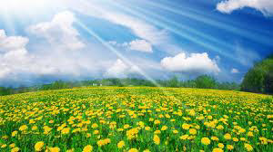
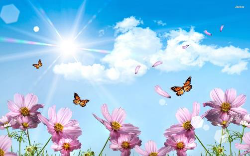
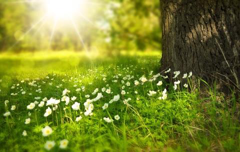
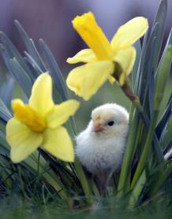
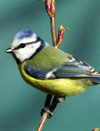
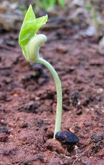
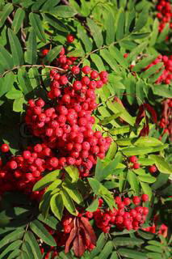
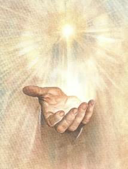
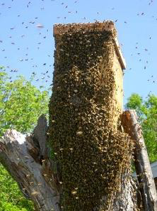

<!-- EXTRACTED IMAGES REFERENCE:
     Copy and paste these images into their correct template slots below!
# Extracted Asset reference: 
# Extracted Asset reference: 
# Extracted Asset reference: 
# Extracted Asset reference: 
# Extracted Asset reference: 
# Extracted Asset reference: 
# Extracted Asset reference: 
# Extracted Asset reference: 
# Extracted Asset reference: 
-->

It’s Official! Spring is here
What we’ve been waiting for;
Days of blue skies and sunshine
Right outside our front door.
Birds singing the dawn chorus
Bees venture out from the hive,
Buds are bursting all around
It feels good to be alive.
Throwing off the winter gloom
As daylight hours increase;
You get a surge of energy
And troubles seem to cease.
We take so much for granted
Seasons change without a thought;
Do we appreciate this timely gift
As gratefully as we ought?
We need rain as well as sunshine
To get plants and seeds to grow;
Frost is sent to kill some buds
Stopping fruit trees overflow.
Summer heat ripens the berries
Drying root crops for winter store;
Just a few examples here
Think about it you’ll find more.
No human hand is able
To do what must be done;
To keep things working smoothly
Here on earth for everyone.
We need this power to guide us
Even on hard paths it would seem;
Let us be forever grateful
For the laws that are supreme.
Spring …. April 2016
Eila Webster

-- 1 of 1 --
