<!-- EXTRACTED IMAGES REFERENCE:
     Copy and paste these images into their correct template slots below!
# Extracted Asset reference: 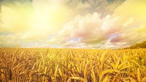
# Extracted Asset reference: 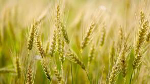
# Extracted Asset reference: 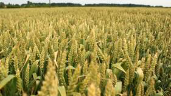
# Extracted Asset reference: 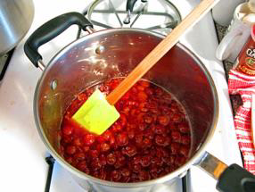
# Extracted Asset reference: 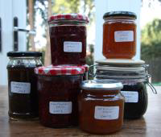
# Extracted Asset reference: 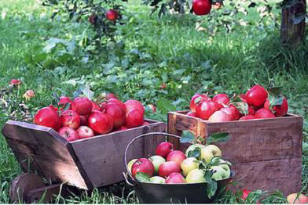
# Extracted Asset reference: 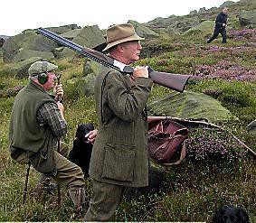
# Extracted Asset reference: 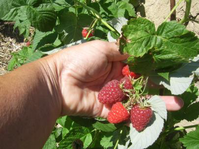
# Extracted Asset reference: 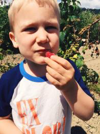
# Extracted Asset reference: 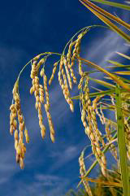
# Extracted Asset reference: 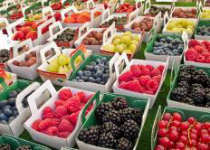
# Extracted Asset reference: 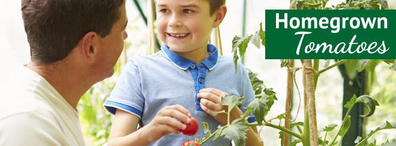
# Extracted Asset reference: 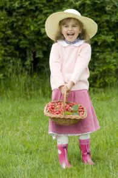
# Extracted Asset reference: 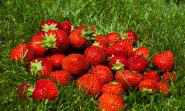
# Extracted Asset reference: 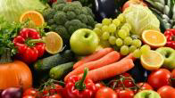
# Extracted Asset reference: 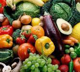
-->

August brings a subtle change
Summer begins to fade away;
Daylight hours are shortening
Gold is showing on grain and hay.
Early crops that were drying
Are ready now to store;
Jam made from July berries
Line the kitchen shelves once more.
Orchard fruit showing a rosy tint
Are tempting boys to the loot;
Heather now blooming on the hills
As huntsmen begin to shoot.
This went on for countless years
And it always served us well;
Waiting eagerly to taste the fruit
As we watched the berries swell.
But as modern ideas filtered in
Fruit is bought now when you shop;
Always available all year through
So berry picking came to a stop.
Why bother with this senseless task
Was the general modern view;
Mass production brought lack of taste
Greatly missed by quite a few.
I think that this is very sad
That children now may never know;
The special taste of home grown fruit
And the chance to see it grow.
August Reflections
By Eila Webster

-- 1 of 1 --
