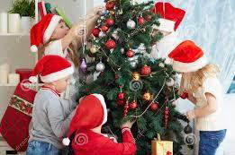
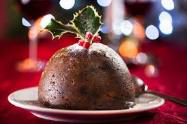
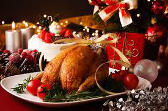
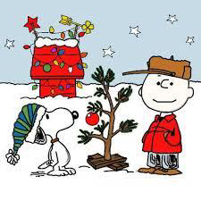
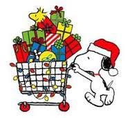
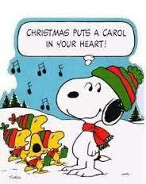
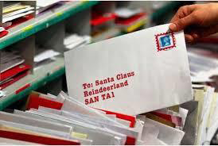
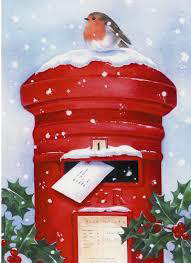
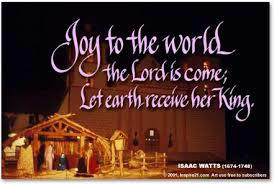
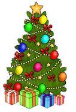

<!-- EXTRACTED IMAGES REFERENCE:
     Copy and paste these images into their correct template slots below!
# Extracted Asset reference: 
# Extracted Asset reference: 
# Extracted Asset reference: 
# Extracted Asset reference: 
# Extracted Asset reference: 
# Extracted Asset reference: 
# Extracted Asset reference: 
# Extracted Asset reference: 
# Extracted Asset reference: 
# Extracted Asset reference: 
# Extracted Asset reference: 
# Extracted Asset reference: 
# Extracted Asset reference: 
-->

It’s the last month of the year
What does it mean to you;
Not enough hours in the day
For the things you have to do.
Cakes to bake plum pudding to make
Christmas cards and presents to buy;
Stretching beyond financial means
No matter how hard you may try.
After a massive long tiring trip
You struggle on home exhausted;
Now all the things you bought await
To be written, wrapped and posted.
No time left for newsy letters
Festive greetings will have to do;
Will another full year pass by
E’er they hear again from you?
Getting cards and expensive gifts
May be lovely to behold;
But newsy letters from the heart
To friends -- are richer than gold.
Forget the trimmings and relax
Recall the good times you are given;
Share memories with those you love
Of blessings sent down from Heaven.
December Celebrations
By Eila Webster

-- 1 of 1 --
