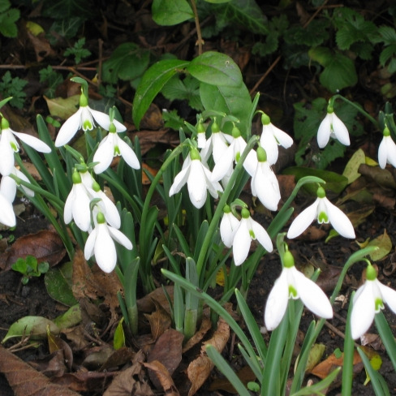
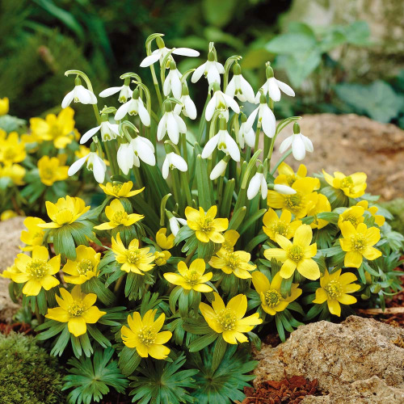
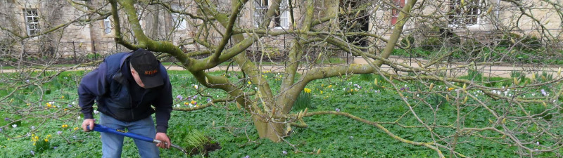
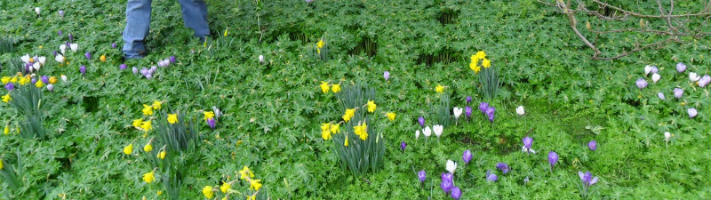
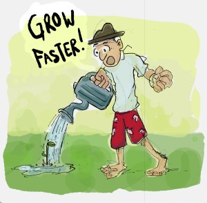
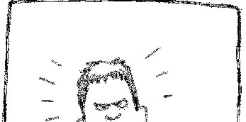
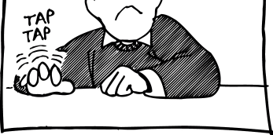

<!-- EXTRACTED IMAGES REFERENCE:
     Copy and paste these images into their correct template slots below!
# Extracted Asset reference: 
# Extracted Asset reference: 
# Extracted Asset reference: 
# Extracted Asset reference: 
# Extracted Asset reference: 
# Extracted Asset reference: 
# Extracted Asset reference: 
# Extracted Asset reference: 
# Extracted Asset reference: 
# Extracted Asset reference: 
# Extracted Asset reference: 
# Extracted Asset reference: 
# Extracted Asset reference: 
# Extracted Asset reference: 
# Extracted Asset reference: 
# Extracted Asset reference: 
# Extracted Asset reference: 
-->

The first month of the year has gone
Does it hold precious memories,
Or filled with doom and gloom
Through the dark winter days?
It really all depends on how
You chose to spend the hours;
Sitting deep in total misery
Or out looking for the flowers.
The pretty snowdrops and aconite
Can cheer hearts with their show;
Still blooming to perfection
No matter what the elements throw
The sun is shining somewhere
And ‘twill shine here, as before;
The waiting will be worth it
We will enjoy it all the more.
February Thoughts	February Thoughts	February Thoughts	February Thoughts
The first month of the year has gone
The pretty snowdrops and aconite
;
No matter what the elements throw.
In the past folk had the patience
So lacking in this modern age
With no time to enjoy the day
As they turn another page
Nature doesn’t work that way
The old rules still hold fast
The four seasons come and go
As they have done in the past
Man has changed so many things
With power and rules they scheme
Yet are unable to change the laws
The ones that are Supreme
And this is as it should be
We still need Our Father’s hand
To guide us on our journey
Through life spent in our birth land
February Thoughts	February Thoughts	February Thoughts	February Thoughts
In the past folk had the patience
So lacking in this modern age;
With no time to enjoy the day
As they turn another page.
Nature doesn’t work that way
The old rules still hold fast;
The four seasons come and go
As they have done in the past.
changed so many things
With power and rules they scheme;
Yet are unable to change the laws
The ones that are Supreme.
And this is as it should be
We still need Our Father’s hand;
To guide us on our journey
Through life spent in our birth land.
By Eila Webster 2016

-- 1 of 1 --
