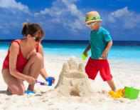
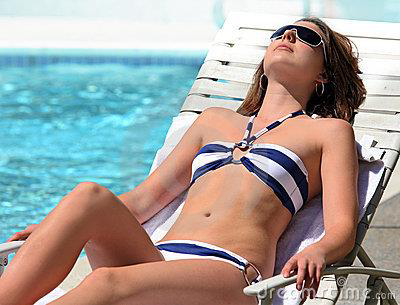
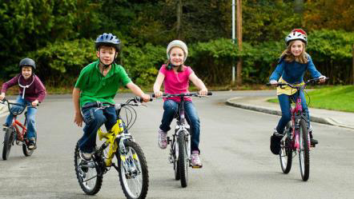
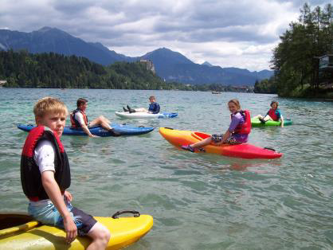
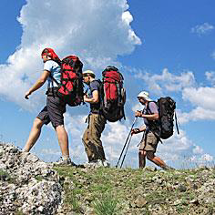
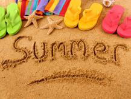

<!-- EXTRACTED IMAGES REFERENCE:
     Copy and paste these images into their correct template slots below!
# Extracted Asset reference: 
# Extracted Asset reference: 
# Extracted Asset reference: 
# Extracted Asset reference: 
# Extracted Asset reference: 
# Extracted Asset reference: 
# Extracted Asset reference: 
# Extracted Asset reference: 
# Extracted Asset reference: 
# Extracted Asset reference: 
# Extracted Asset reference: 
# Extracted Asset reference: 
# Extracted Asset reference: 
# Extracted Asset reference: 
-->

Its July we’re in mid-summer
Full of happy halcyon days;
Filling all the leisure hours
In many different ways.
Seaside joys are calling
Building castles in the sand;
Getting on your bikini now
Hoping you’ll soon get tanned.
Or attending fete’s and fairs
Eating ice cream and candy floss;
Just doing what you fancy
As you give the coins a toss.
Or climbing up a mountain
Admiring the wonderful view;
Maybe sailing in calm waters
When the sea and skies are blue.
We all need a while just to relax
And July seems the perfect time;
To dump bad habits, fear and woe
So read this simple rhyme.
Folk say that I am good with words
They just come out of the blue;
So I thought I would pen these lines
Hoping they might benefit you.
When taking up the oar again
Leave behind all care and strife;
You’ll be refreshed and ready
To face the challenges of life.
The Mid-Summer Days in July
By Eila Webster 2016

-- 1 of 1 --
