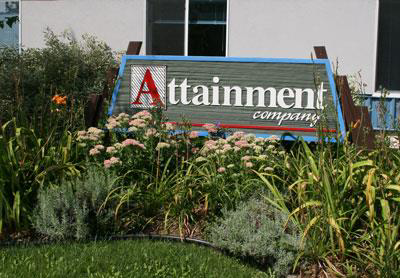
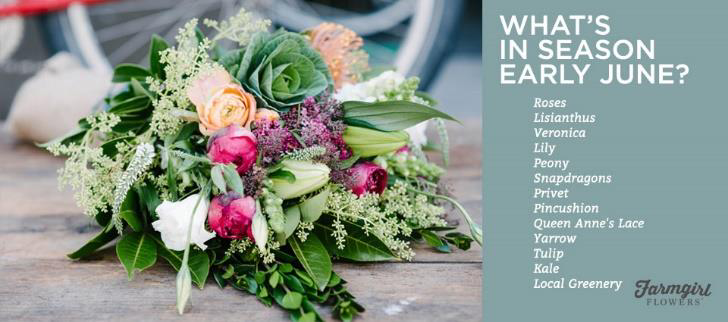

<!-- EXTRACTED IMAGES REFERENCE:
     Copy and paste these images into their correct template slots below!
# Extracted Asset reference: 
# Extracted Asset reference: 
# Extracted Asset reference: 
# Extracted Asset reference: 
# Extracted Asset reference: 
# Extracted Asset reference: 
# Extracted Asset reference: 
# Extracted Asset reference: 
# Extracted Asset reference: 
# Extracted Asset reference: 
# Extracted Asset reference: 
# Extracted Asset reference: 
# Extracted Asset reference: 
# Extracted Asset reference: 
# Extracted Asset reference: 
-->

Now that we are into June
The year is almost half way through;
Thinking back to resolutions made
Have you all learned something new?
Thoughts are now fixed on holidays
All the excitement out there to find;
But when the short break is over
It’s just back to the daily grind.
To earn a wage may be necessary
But what is important too;
Is to find out that special talent
You can cultivate all life through.
People were meant to be happy
Enjoying a full interesting life;
Proud of all their attainments
Not bogged down with care and strife.
But if you have no real incentive
Holding new interests to fill your days;
Keeping your grey cells active
In a great many different ways.
As you settle down into a rut
You would soon fail to realise;
How fast the years are passing
‘til a slow bent frame catches your eyes.
Fulfil all your ambitions now
You’ll succeed if you really try;
You have lost the first five months
Don’t let the whole year pass you by.
Eila Webster 2016
The Happy Month of June!

-- 1 of 1 --
