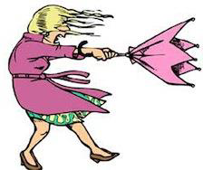
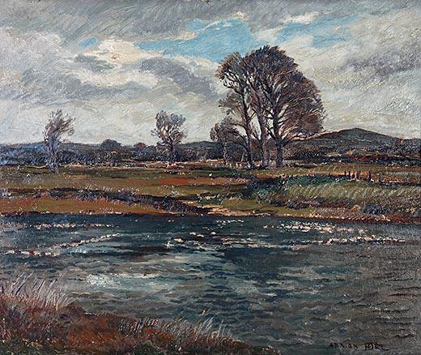
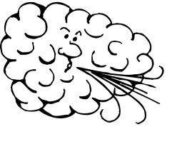
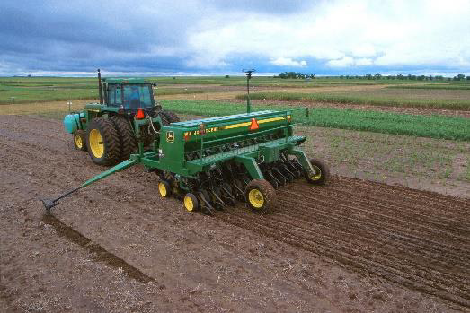
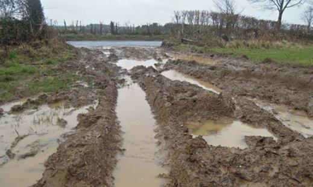
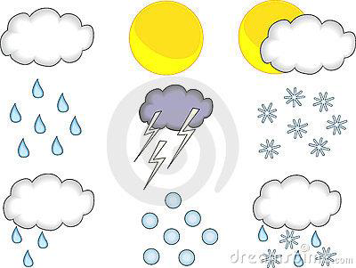
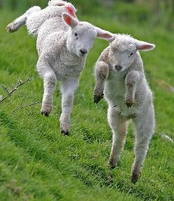

<!-- EXTRACTED IMAGES REFERENCE:
     Copy and paste these images into their correct template slots below!
# Extracted Asset reference: 
# Extracted Asset reference: 
# Extracted Asset reference: 
# Extracted Asset reference: 
# Extracted Asset reference: 
# Extracted Asset reference: 
# Extracted Asset reference: 
# Extracted Asset reference: 
# Extracted Asset reference: 
-->

March weather is unpredictable
It holds winter by the tail;
Though daylight hours are longer
It can bring sleet, snow and hail.
There’s little heat in sunshine
As you shiver in the blast;
All too soon it disappears
And the sky gets overcast.
You long to dig the garden
Which is still a sea of mud;
A night frost suddenly arrives
To nip that in the bud.
Farmers look for a dry spell
To get cropping on the way;
Next day there comes a gale
That blows the seeds away.
Are you glad when March ends
But it still leaves its sting;
Borrowing three days from April ***
That must pass e’er we get to Spring.
There’s some truth in old legends
That still stand from bygone days;
Forecasts were made too back then
Only looked for in different ways.
Depending on signs and sayings
Not like all this modern gear;
So it was studied tirelessly
To make their forecast clear.
Sometimes put into a rhyme
That would stay in the memory;
And has proved quite reliable
Even up to the present day.
I cannot forecast the weather
NO! I wouldn’t even try;
I check it daily in the press
And with old Rhymes I get by.
By Eila Webster 2016
March Reflections 2016
*** Line taken from rhyme
“The Borrowing Days”

-- 1 of 1 --
