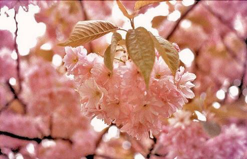
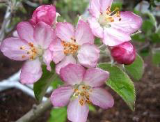
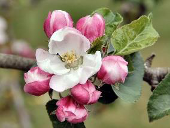
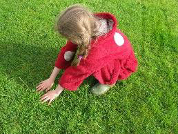
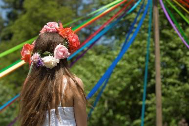
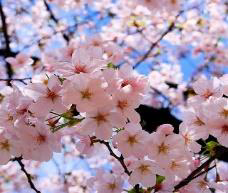
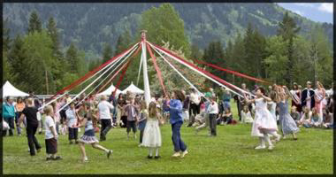

<!-- EXTRACTED IMAGES REFERENCE:
     Copy and paste these images into their correct template slots below!
# Extracted Asset reference: 
# Extracted Asset reference: 
# Extracted Asset reference: 
# Extracted Asset reference: 
# Extracted Asset reference: 
# Extracted Asset reference: 
# Extracted Asset reference: 
# Extracted Asset reference: 
# Extracted Asset reference: 
# Extracted Asset reference: 
# Extracted Asset reference: 
# Extracted Asset reference: 
# Extracted Asset reference: 
-->

I think of May as blossom time
Trees all decked in pink and white;
In Parks and lining pathways
They create a breath-taking sight.
Bringing thought of first love
Fragile, wonderful and new;
It didn’t matter how it ended
The memories live on all life through.
There is no emotion greater
Even though it ends in tears;
It is something you don’t feel again
Through all your adult years.
Love in later years is different
May brings a bright new start;
Now is the time to take control
Yes! We can all take part.
It doesn’t matter about age
Or all the silver in your hair;
May gives that vital spark
To all hearts beating there.
Women would wash their faces
In dew on the 1st of May;
T’was said to make them beautiful
A ritual unknown today.
Studying the months is fascinating
Each one has a tale to tell;
Pulling you closer to nature
To find they all serve you well.
May Reflections
By Eila Webster

-- 1 of 1 --
