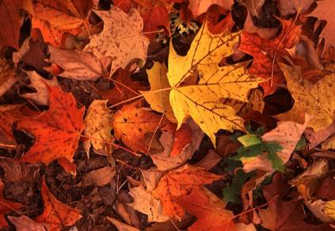
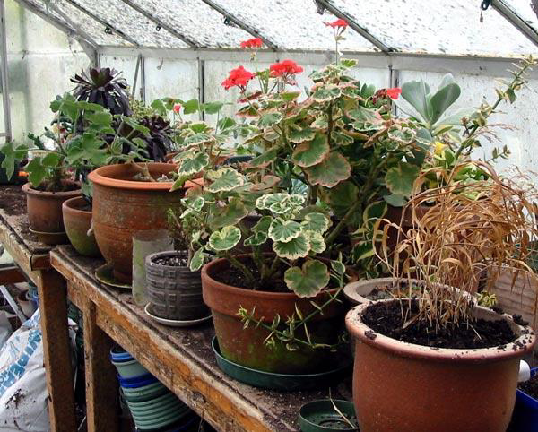
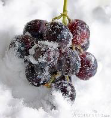
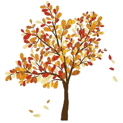
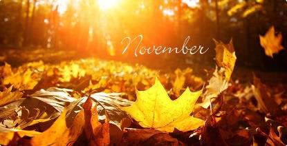
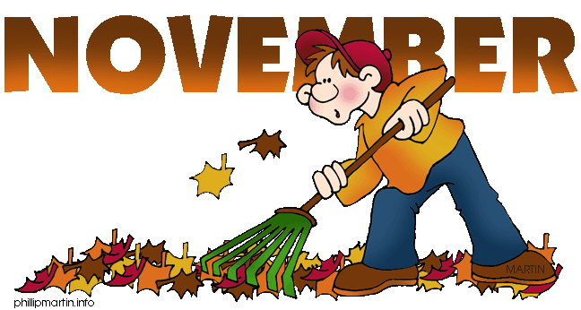
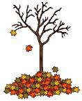

<!-- EXTRACTED IMAGES REFERENCE:
     Copy and paste these images into their correct template slots below!
# Extracted Asset reference: 
# Extracted Asset reference: 
# Extracted Asset reference: 
# Extracted Asset reference: 
# Extracted Asset reference: 
# Extracted Asset reference: 
# Extracted Asset reference: 
# Extracted Asset reference: 
# Extracted Asset reference: 
# Extracted Asset reference: 
# Extracted Asset reference: 
# Extracted Asset reference: 
# Extracted Asset reference: 
# Extracted Asset reference: 
-->

We are into November now,
It is so hard to comprehend;
How fast the months are passing,
The Year will soon be at an end.
Gale force winds are now blowing,
Stripping many trees completely bare;
The falling leaves form a soft carpet,
From what’s been tossed into the air.
Time now to get pot plants indoors,
For an extended floral treat;
If you want to save their show,
Give them some gentle heat.
Keep what you value most of all,
You would be sad if they were lost;
Yet the seeded black grapes now,
Are sweeter when touched by frost.
You may sometimes take a gamble,
And do things that make you quake;
You could still be on a winner,
Just by making some small mistake.
So! Do something in November,
To cause some laughter and a smile;
Helping to recharge batteries,
When you go that extra mile.
By Eila Webster

-- 1 of 1 --
