<!-- EXTRACTED IMAGES REFERENCE:
     Copy and paste these images into their correct template slots below!
# Extracted Asset reference: 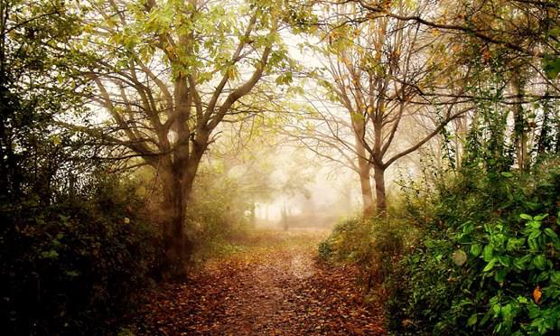
# Extracted Asset reference: 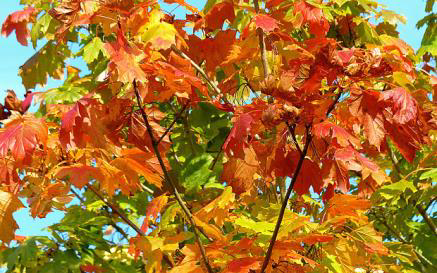
# Extracted Asset reference: 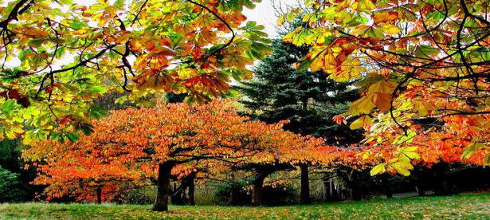
# Extracted Asset reference: 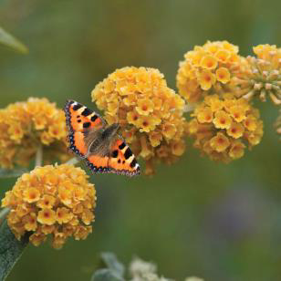
# Extracted Asset reference: 
# Extracted Asset reference: 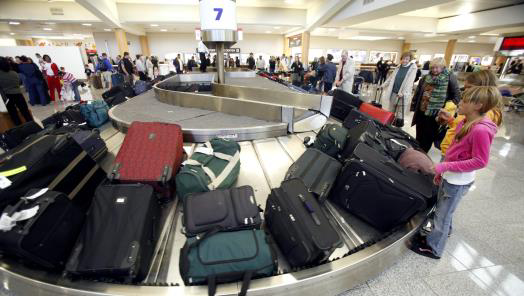
# Extracted Asset reference: 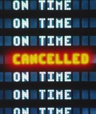
# Extracted Asset reference: 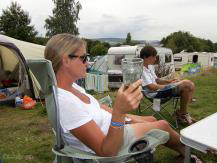
# Extracted Asset reference: 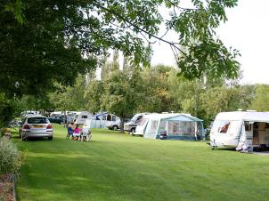
# Extracted Asset reference: 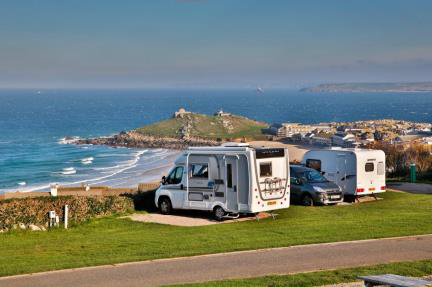
# Extracted Asset reference: 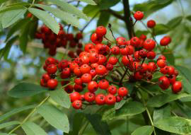
# Extracted Asset reference: 
# Extracted Asset reference: 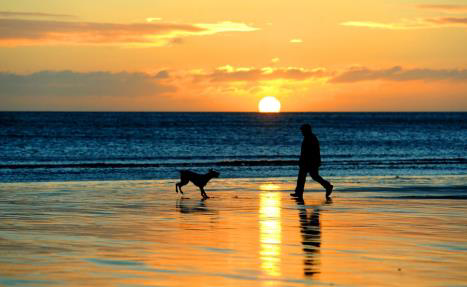
# Extracted Asset reference: 
-->

I look forward to September
With its warm mellow days;
Trees full of radiant colours
Breathtaking, worthy of praise.
Perfect time to take a Holiday
No need to travel far;
Enjoy the beauty of your Homeland
Easily reached by train or car.
Why struggle with loads of luggage,
Getting passports booking a plane;
Exchanging currency, getting jags
Gives you lots of stress that’s plain.
You can be in another world
Just staying a few miles away;
There’s so much beauty lurking there
Wherever you choose to stay.
Holidays should not be competitive
Boasting to others where you’ve been;
They are meant to restore and relax you
By the restful sights you’ve seen.
Coming at this time of year
Showing nature at its best;
September in all its glory
Stands well above the rest .
Goodbye August …. Hello September
By Eila Webster

-- 1 of 1 --
