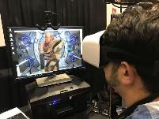
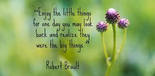
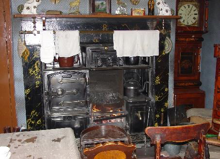
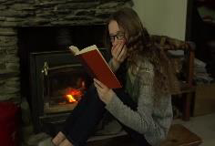
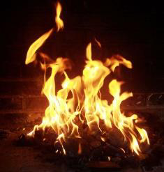

<!-- EXTRACTED IMAGES REFERENCE:
     Copy and paste these images into their correct template slots below!
# Extracted Asset reference: 
# Extracted Asset reference: 
# Extracted Asset reference: 
# Extracted Asset reference: 
# Extracted Asset reference: 
# Extracted Asset reference: 
# Extracted Asset reference: 
# Extracted Asset reference: 
# Extracted Asset reference: 
# Extracted Asset reference: 
# Extracted Asset reference: 
# Extracted Asset reference: 
# Extracted Asset reference: 
-->

Young folk say that they are bored,
Yet they have got so much;
With all the gadgets they have now,
No trouble keeping in touch.
Entertainment is laid on for them,
No need even to think;
Yet many seem to lose the way,
And take to drugs and drink.
So different now from days gone by,
You’d to seek out your own treasure;
And it always was the simplest things,
That brought the greatest pleasure.
I still remember as a small child,
I would sit by the warm coal fire;
And listen to the kettle hum,
Of its soft sound I’d never tire.
Fascinated by changing pictures,
I could see in the firelight glow;
To me it was like fairyland,
Oh…. How I loved it so.
Yes, I have my coal fire yet,
Though I am now old and grey;
It transports me into another world,
As I dream the hours away.
Still finding pleasure in the things,
That I did when I was small;
Reliving the happy memories too,
As those fire pictures I recall.
My message is simple - Go out and play,
The time spent will all be gain;
The young will remember it in years to come,
Just as I do … with the firelight flame.
Memories of Long Ago
By Eila Webster

-- 1 of 1 --
