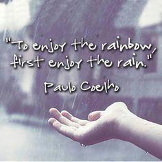
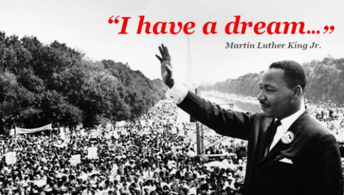
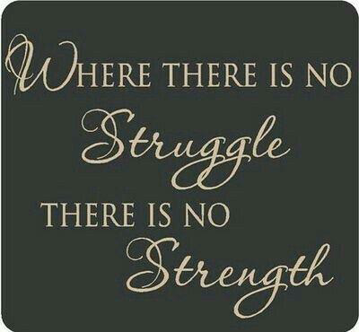
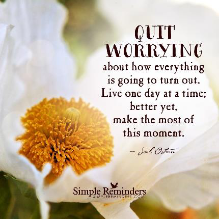
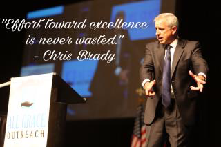
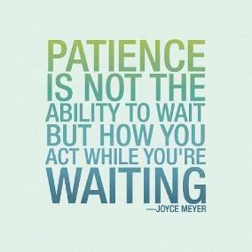
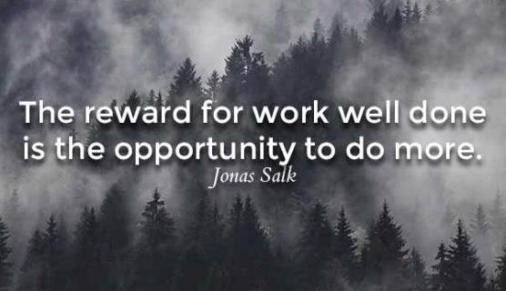

<!-- EXTRACTED IMAGES REFERENCE:
     Copy and paste these images into their correct template slots below!
# Extracted Asset reference: 
# Extracted Asset reference: 
# Extracted Asset reference: 
# Extracted Asset reference: 
# Extracted Asset reference: 
# Extracted Asset reference: 
# Extracted Asset reference: 
# Extracted Asset reference: 
# Extracted Asset reference: 
# Extracted Asset reference: 
# Extracted Asset reference: 
# Extracted Asset reference: 
# Extracted Asset reference: 
# Extracted Asset reference: 
# Extracted Asset reference: 
-->

Hopes and dreams can be fulfilled,
Just don’t give up the fight;
But carry on and do your Best,
They’ll come when time is right .
Trials and struggles are not in vain,
Though sometimes the journey’s hard;
Make the effort you won’t fail,
You will get your just reward .
Don’t look for it tomorrow though;
Next week? Next month? Next year?
Have patience. One day it will come
To fill your heart with cheer.
A good job done is never wasted,
Whether it be large or small;
It can hold countless blessings,
Bringing great benefit to all.
Always Give of your Best
By Eila Webster

-- 1 of 1 --
