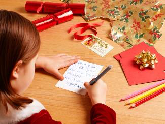
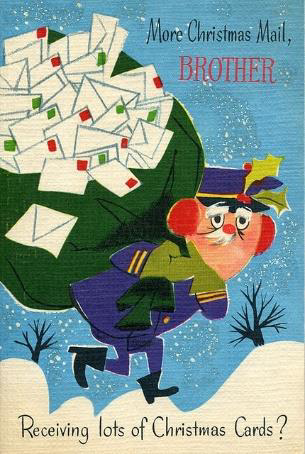
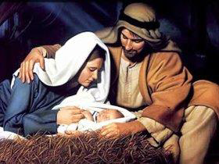
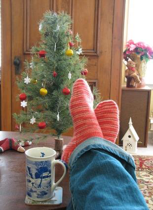

<!-- EXTRACTED IMAGES REFERENCE:
     Copy and paste these images into their correct template slots below!
# Extracted Asset reference: 
# Extracted Asset reference: 
# Extracted Asset reference: 
# Extracted Asset reference: 
# Extracted Asset reference: 
# Extracted Asset reference: 
# Extracted Asset reference: 
# Extracted Asset reference: 
# Extracted Asset reference: 
# Extracted Asset reference: 
# Extracted Asset reference: 
# Extracted Asset reference: 
# Extracted Asset reference: 
# Extracted Asset reference: 
# Extracted Asset reference: 
# Extracted Asset reference: 
# Extracted Asset reference: 
-->

We’re in the last month of the year,
It’s time to get out the pen;
Cards are sent to family and friends,
With Festive Wishes once again.
This job done you pat your back.
You’re free, your conscience clear;
Now it’s time to have some fun ,
And relax for another year.
Stop! and think of the other end ,
Someone who’d love a newsy letter;
A visit from you through the year,
And a chat is even better.
Christmas is all about Love and Joy,
Freely given from a Baby Boy;
Who grew up and died that we could live,
Go patch up your quarrels and forgive.
This Christmas give thought to others too,
Show kindness ‘twill come back to you;
May this festive season bring you cheer,
With Good Health to all …from your Bard here.
Christmas
By Eila Webster

-- 1 of 1 --
