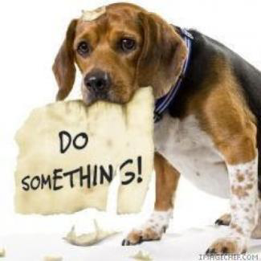
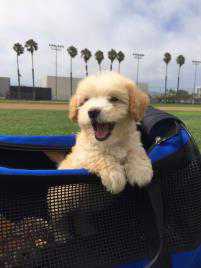
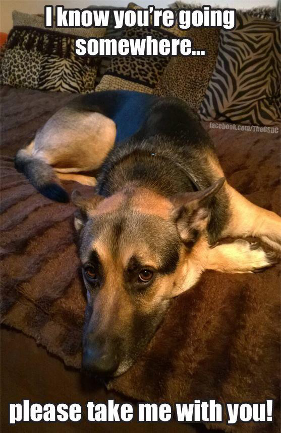
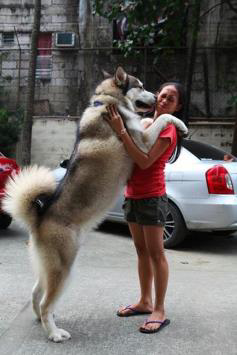
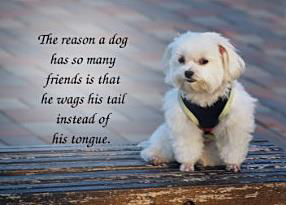

<!-- EXTRACTED IMAGES REFERENCE:
     Copy and paste these images into their correct template slots below!
# Extracted Asset reference: 
# Extracted Asset reference: 
# Extracted Asset reference: 
# Extracted Asset reference: 
# Extracted Asset reference: 
# Extracted Asset reference: 
# Extracted Asset reference: 
# Extracted Asset reference: 
# Extracted Asset reference: 
# Extracted Asset reference: 
# Extracted Asset reference: 
# Extracted Asset reference: 
# Extracted Asset reference: 
-->

You chose me a little Pup,
And took me to your home;
I became part of the family,
Who took me out to roam.
Oh the happy times we had,
It made me jump for joy;
You bought me a bouncy ball,
And a little squeaky toy.
But the good times didn’t last,
E’er I was fully grown;
You left me cold and hungry,
Bewildered and alone.
When I saw you drive away,
I tried the car to chase;
But I got so tired and weary,
I just couldn’t keep the pace.
Why did you go and leave me,
May your heart hear my cries;
And remember the adoration,
That shone out of my eyes.
Please come back and find me,
I have so much love to give;
If only you would take me,
Back to your home to live.
This is just one doggie’s story,
Alas there are many more;
When the novelty has worn off,
They are just thrown out the door.
How can humans’ be so cruel,
To what’s termed as man’s best friend;
Serving it’s master willingly,
It’s so hard to comprehend.
Not a toy to be cast aside,
It should be classed as family;
A true and faithful companion,
Right up to it’s dying day.
A Sad Dog
By Eila Webster

-- 1 of 1 --
