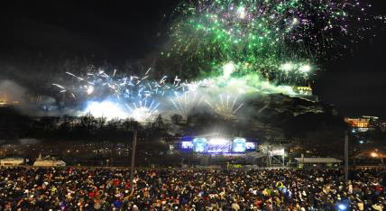
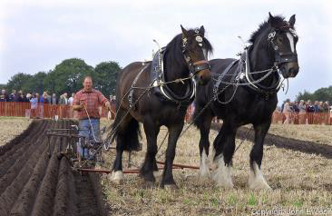
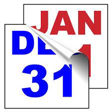
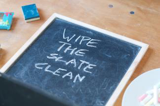
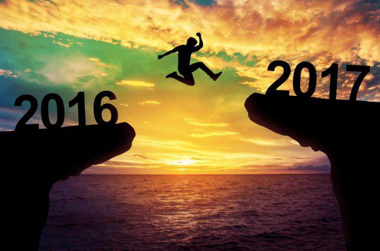
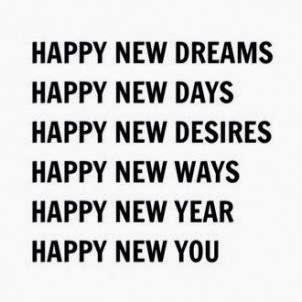
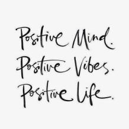
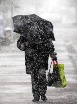

<!-- EXTRACTED IMAGES REFERENCE:
     Copy and paste these images into their correct template slots below!
# Extracted Asset reference: 
# Extracted Asset reference: 
# Extracted Asset reference: 
# Extracted Asset reference: 
# Extracted Asset reference: 
# Extracted Asset reference: 
# Extracted Asset reference: 
# Extracted Asset reference: 
# Extracted Asset reference: 
# Extracted Asset reference: 
-->

The year is coming to an end,
And whether it be good or ill;
Leave the past behind pick up the reins,
And plough a fresh new drill.
For a New Year is the perfect time,
As the slate has been wiped clean;
So square your shoulders and march on,
Leave behind what might have been.
You don’t know yet what lies in store,
Or to where your footsteps may lead;
Open your eyes to the possibilities,
And you could be surprised indeed.
Life’s journey is how you take it,
When a storm comes out of the blue;
Do you calmly put an umbrella up,
Or curse fate till you’re soaked through.
Yes, there are two sides to everything,
Waiting right there for you to find;
For it all depends on how you respond,
To Life’s journey where your footsteps wind.
Looking to the Future
By Eila Webster

-- 1 of 1 --
