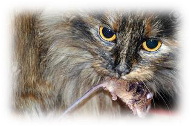
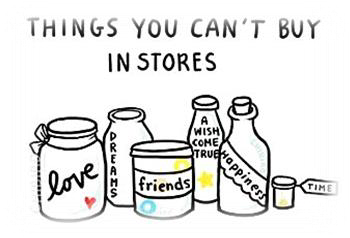

<!-- EXTRACTED IMAGES REFERENCE:
     Copy and paste these images into their correct template slots below!
# Extracted Asset reference: 
# Extracted Asset reference: 
# Extracted Asset reference: 
# Extracted Asset reference: 
# Extracted Asset reference: 
# Extracted Asset reference: 
# Extracted Asset reference: 
# Extracted Asset reference: 
# Extracted Asset reference: 
# Extracted Asset reference: 
-->

Tempting offers of wealth are increasing,
You can see this happening everywhere;
Just buy something and win cash,
It could be a scam – so beware!
Although this is above board normally,
Just hoping this will increase the demands;
And you could still get a real bargain,
On wares that are left in their hands.
But when offers seem too good to be true,
Although tempting it could be just that;
Not many would give cash so freely’
You can’t take a mouse from a cat!
But one money cheque will be paid out,
At the end to keep promises true;
But out from a million hopefuls there,
It’s unlikely to be for me or for you.
Be prepared to work hard all your life,
For most things don’t work out as planned;
Remember the best things in life are free,
And you are holding them now in your hand.
Free Gifts
By Eila Webster

-- 1 of 1 --
