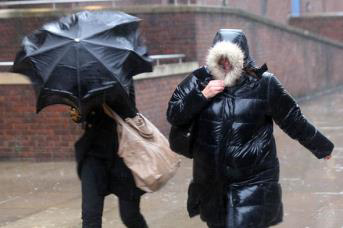
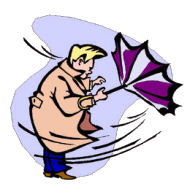
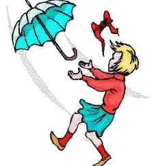
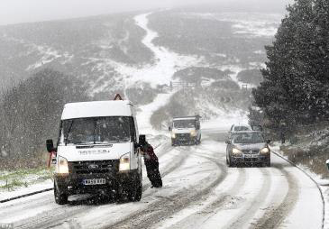
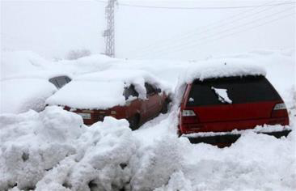
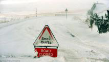
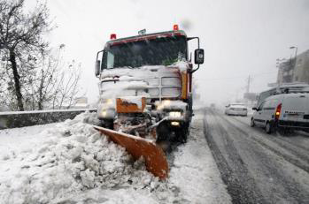
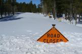
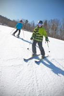
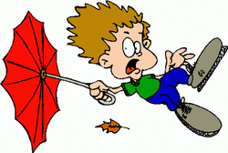

<!-- EXTRACTED IMAGES REFERENCE:
     Copy and paste these images into their correct template slots below!
# Extracted Asset reference: 
# Extracted Asset reference: 
# Extracted Asset reference: 
# Extracted Asset reference: 
# Extracted Asset reference: 
# Extracted Asset reference: 
# Extracted Asset reference: 
# Extracted Asset reference: 
# Extracted Asset reference: 
# Extracted Asset reference: 
# Extracted Asset reference: 
# Extracted Asset reference: 
# Extracted Asset reference: 
# Extracted Asset reference: 
# Extracted Asset reference: 
-->

December was fresh and open,
And January was quite mild;
Mostly dry and sunny days,
Although gale force winds were wild.
Our seasons are all changing,
Some days it feels like spring;
The sunshine is now warming up,
And the birds are on the wing.
To be outdoors is tempting,
Yes! optimists may be forgiven;
For thinking winter is at an end,
Cast your mind back to 1947.
After a mild start in January,
Came blocked roads for weeks on end;
Snow seemingly piled up to the sky,
It nearly drove folk round the bend!
‘This won’t happen now’ the experts say,
New equipment will keep roads clear;
But no human hand is able to,
When storms unexpectedly appear.
A higher power is in control,
And we must accept what comes;
And like the birds be grateful,
For the day’s we’re given crumbs.
Check the months on the calendar,
Spring will come in its own time;
All the sweeter for the waiting,
And bringing an end to this rhyme.
By Eila Webster

-- 1 of 1 --
