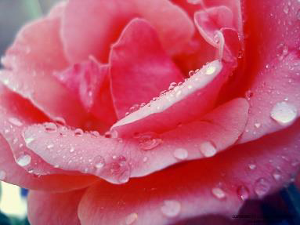
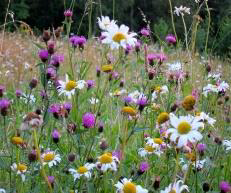
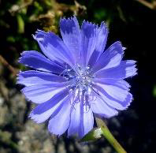
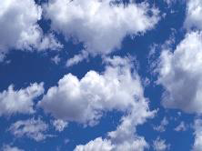
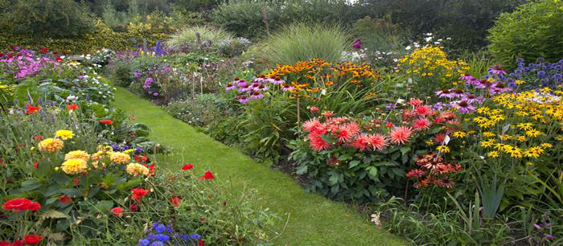
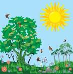
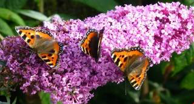
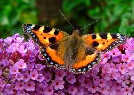
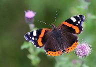
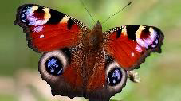

<!-- EXTRACTED IMAGES REFERENCE:
     Copy and paste these images into their correct template slots below!
# Extracted Asset reference: 
# Extracted Asset reference: 
# Extracted Asset reference: 
# Extracted Asset reference: 
# Extracted Asset reference: 
# Extracted Asset reference: 
# Extracted Asset reference: 
# Extracted Asset reference: 
# Extracted Asset reference: 
# Extracted Asset reference: 
# Extracted Asset reference: 
# Extracted Asset reference: 
# Extracted Asset reference: 
# Extracted Asset reference: 
# Extracted Asset reference: 
# Extracted Asset reference: 
# Extracted Asset reference: 
# Extracted Asset reference: 
-->

A young maid stood in the garden,
Filled with wonder in the sun;
That shone down on the brilliant flowers,
As she studied everyone.
She bent and picked a blush pink rose,
And as she held the stem;
She gazed upon the dewdrop there,
Shining brightly like a gem.
She scanned the purple heather hills,
The valley lush and green;
And shining like a silver band,
The sunlight on a stream.
She looked up at the fleecy clouds,
Skimming o’er the blue;
Butterflies all fluttering round,
Was fascinating for her too .
Why do I tell this simple tale,
Of things so common place?
A night of stars, a garden gay,
Or the rapture on a face.
These things we take for granted,
Often unnoticed you will find;
Unless by someone like this maid,
Who until today was blind.
The skill of a surgeon gave her sight,
And brought this thought to me;
Just how little we appreciate the gifts,
The ones we are given free.
The Precious Gift
By Eila Webster

-- 1 of 1 --
