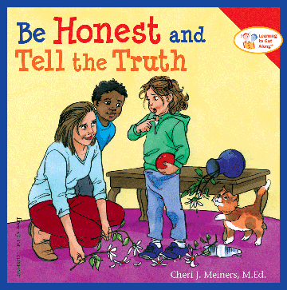
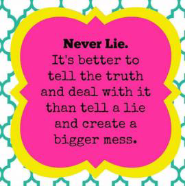
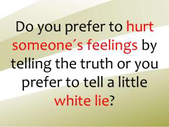
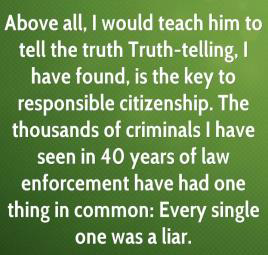
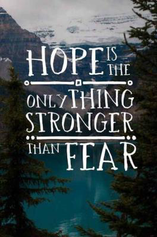
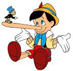
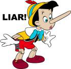
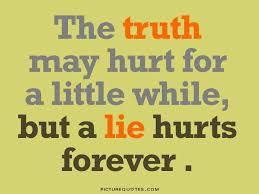
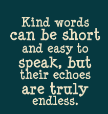
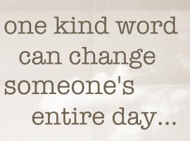

<!-- EXTRACTED IMAGES REFERENCE:
     Copy and paste these images into their correct template slots below!
# Extracted Asset reference: 
# Extracted Asset reference: 
# Extracted Asset reference: 
# Extracted Asset reference: 
# Extracted Asset reference: 
# Extracted Asset reference: 
# Extracted Asset reference: 
# Extracted Asset reference: 
# Extracted Asset reference: 
# Extracted Asset reference: 
# Extracted Asset reference: 
# Extracted Asset reference: 
# Extracted Asset reference: 
# Extracted Asset reference: 
# Extracted Asset reference: 
# Extracted Asset reference: 
# Extracted Asset reference: 
-->

You should always tell the truth,
We were taught when we were young!
Lies were dangerous and evil,
When they rolled off your tongue.
Very reliable, Yes in theory,
But in practice this doesn’t fit;
We all lie from day to day,
Without being aware we’re doing it.
Oh! Not in an earth shattering way,
But it is a lie just the same;
Yet sometimes it turns out better,
To tell a small one without shame.
Consider all your words with care,
Will they open a wound or heal?
Should we keep using cold hard truth,
When kind words have more appeal.
Yes! We all live in an evil world,
Where harsh truth must be applied;
Trying to shake hardened criminals,
To confess that they had lied.
Remember where there’s life there’s hope,
And miracles do happen sometimes;
So when in doubt give comfort,
And read again these lines.
We cannot foresee the future,
Or how any situation will end;
So never hesitate to pass on hope,
To warm the bosom of a friend.
Truth or Lie
By Eila Webster

-- 1 of 1 --
