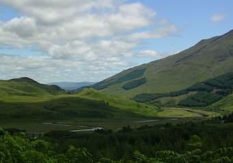
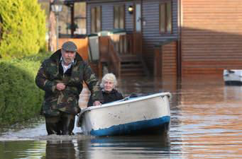
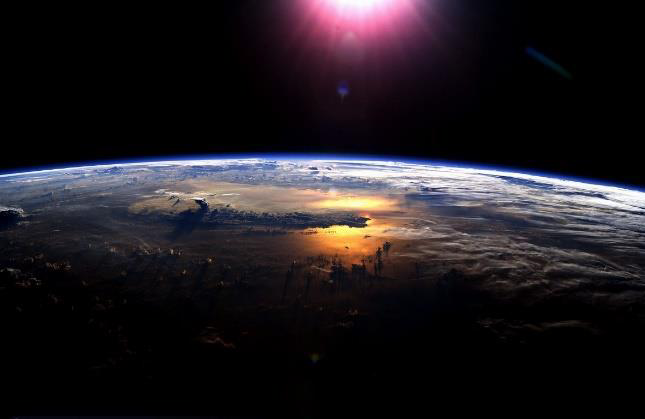

<!-- EXTRACTED IMAGES REFERENCE:
     Copy and paste these images into their correct template slots below!
# Extracted Asset reference: 
# Extracted Asset reference: 
# Extracted Asset reference: 
# Extracted Asset reference: 
# Extracted Asset reference: 
# Extracted Asset reference: 
# Extracted Asset reference: 
# Extracted Asset reference: 
# Extracted Asset reference: 
# Extracted Asset reference: 
-->

Come everyone hold your head up high,
The sun shines somewhere in a blue sky;
Shedding her ray on some distant shore,
And one day soon it will shine once more.
On our own Scottish lush and fertile land,
Though Universal Law’s hard to understand;
When the wind and rain ‘neath darkened skies,
And our flooded garden before us lies.
How we long to change it if only we could,
But the Law still remains firm for our good;
As death and birth go on unchanging,
This Higher Power does the arranging.
We will get sunshine when the time is right,
Filling our days with her wonderful light;
A rich coloured arc will appear in the blue’
The Promise that all will come right for you.
The Promise
By Eila Webster

-- 1 of 1 --
