<!-- EXTRACTED IMAGES REFERENCE:
     Copy and paste these images into their correct template slots below!
# Extracted Asset reference: 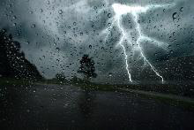
# Extracted Asset reference: 
# Extracted Asset reference: 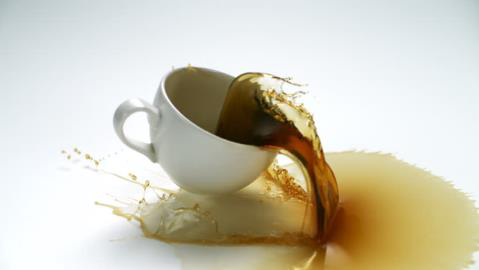
# Extracted Asset reference: 
# Extracted Asset reference: 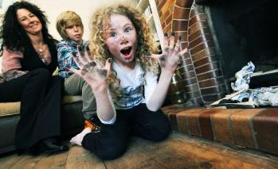
# Extracted Asset reference: 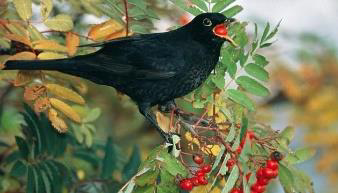
# Extracted Asset reference: 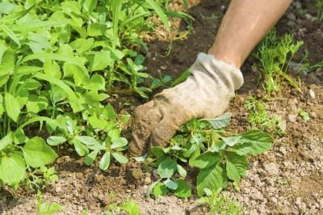
# Extracted Asset reference: 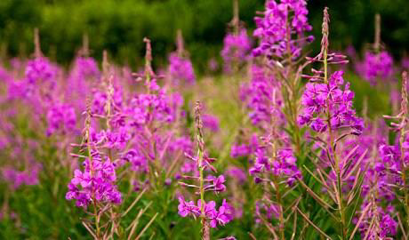
# Extracted Asset reference: 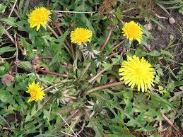
# Extracted Asset reference: 
# Extracted Asset reference: 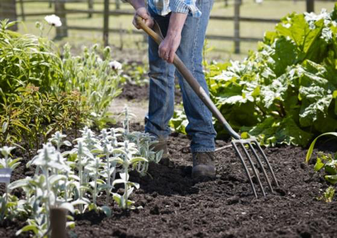
# Extracted Asset reference: 
# Extracted Asset reference: 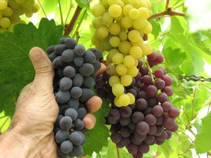
# Extracted Asset reference: 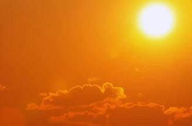
# Extracted Asset reference: 
# Extracted Asset reference: 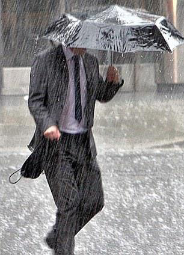
-->

If it’s no ae thing it’s anither,
Like bein annoyed by a sister or brither;
Or coupin a cup o tea in yer lap,
Fa’in aff the chair fan haein a nap.
Preparin for freens that dinna come,
Gettin a sooty blaw doon frae the lum;
Growin fruit that the birds keep eatin,
They nab them a’ I feel like greetin.
The weeds keep on growin it maks me seek,
Havin tae clear the same bit ulky week;
Aines I canna dae for I’m no able,
Are tourin as high as the tower o Babel.
Noo the grapes still sma are roasted green,
Some days the temperature is extreme;
I canna understand this summer ava,
It seems tae gie us athing but sna.
Roasted ae meenit syne soaked tae the skin,
Whatever I dae I jist canna win;
This maks we winder is it me or the weather,
For if it’s no the tae thing it’s the tither.
Just for a laugh
By Eila Webster

-- 1 of 1 --
