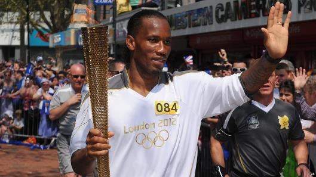
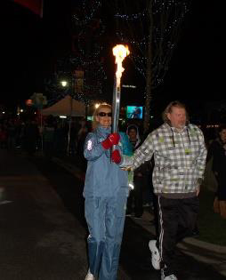
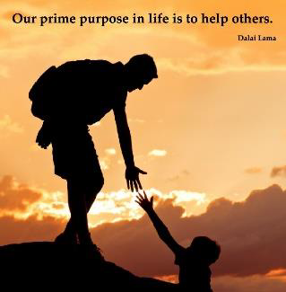
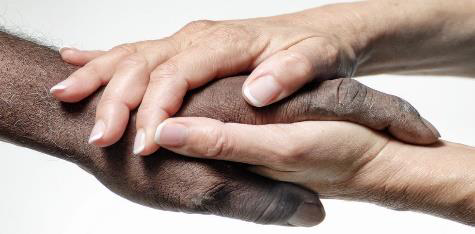
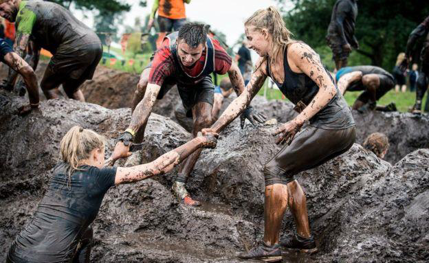
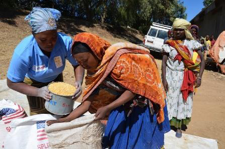
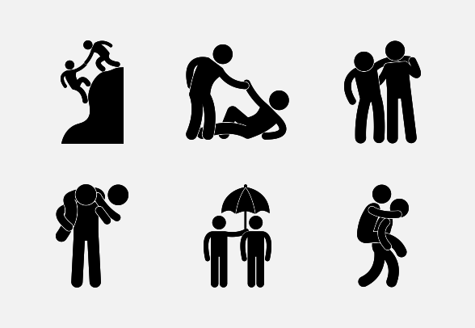

<!-- EXTRACTED IMAGES REFERENCE:
     Copy and paste these images into their correct template slots below!
# Extracted Asset reference: 
# Extracted Asset reference: 
# Extracted Asset reference: 
# Extracted Asset reference: 
# Extracted Asset reference: 
# Extracted Asset reference: 
# Extracted Asset reference: 
# Extracted Asset reference: 
# Extracted Asset reference: 
# Extracted Asset reference: 
# Extracted Asset reference: 
# Extracted Asset reference: 
# Extracted Asset reference: 
# Extracted Asset reference: 
-->

Carry the torch with head held high,
The flame grows brighter as the miles go by;
Through the longest day and darkest night,
The torch you hold will give you light.
To show you clearly what lies ahead,
On the path of life you daily tread;
Our role in life is to help each other ,
A father mother, sister or brother.
But if anyone keeps pushing kind aid aside,
Just let it flow off on the morning tide;
And carry on leaving those fetters behind,
Gaining courage strength and peace of mind.
Still remember when running your life through,
All the new friends made from help by you;
So carry on running with patience and grace,
Showing how you can make Earth a better place.
The seeds have been sown you have passed the test,
And someday you will be truly blessed;
When the race is won and the torch is laid down,
You will get the honour of wearing a crown.
Life’s Race
By Eila Webster

-- 1 of 1 --
