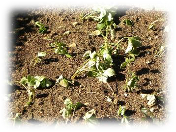
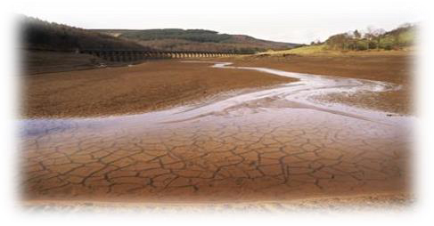
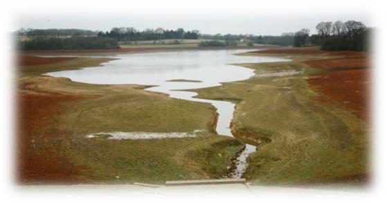
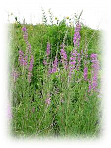
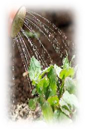

<!-- EXTRACTED IMAGES REFERENCE:
     Copy and paste these images into their correct template slots below!
# Extracted Asset reference: 
# Extracted Asset reference: 
# Extracted Asset reference: 
# Extracted Asset reference: 
# Extracted Asset reference: 
# Extracted Asset reference: 
# Extracted Asset reference: 
# Extracted Asset reference: 
# Extracted Asset reference: 
-->

The Year will soon be twa thirds in,
And we’ve a got a roasted skin;
For weeks we sweltered in the heat,
A shower o’ rain wad hae bin a treat.
But drizzles forecast failed tae arrive,
Gairdan plants struggled tae survive;
But to gie them watter – twas goodbye,
For even the loch was gaein dry.
I canna recall the like ye see,
Through a’ my years up tae Ninety-three;
We had hot spells ‘dinna get me wrang’,
But no sae intensive nor sae lang.
We are getting back tae normal noo,
As cloudy skies cover up the blue;
Wi’ drizzly rain the plants survive,
And towerin’ weeds stretch tae the skies.
As we gae frae ae thing tae another,
It’s best we canna control the weather;
It’ll change when the nicht time comes,
So there’s nae need tae bite yer thumbs.
Just carry on, keep daein’ yer best,
Leave a higher Power tae dae the rest;
His Heavenly hand is there ye see,
Guiding Earth mortals like you and me.
Summer Weather
By Eila Webster

-- 1 of 1 --
