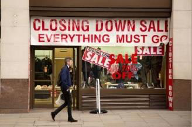
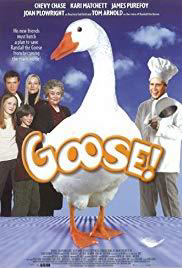
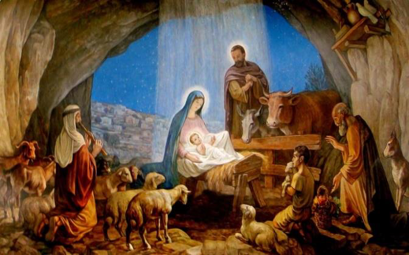
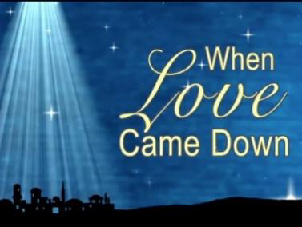

<!-- EXTRACTED IMAGES REFERENCE:
     Copy and paste these images into their correct template slots below!
# Extracted Asset reference: 
# Extracted Asset reference: 
# Extracted Asset reference: 
# Extracted Asset reference: 
# Extracted Asset reference: 
# Extracted Asset reference: 
# Extracted Asset reference: 
# Extracted Asset reference: 
# Extracted Asset reference: 
# Extracted Asset reference: 
# Extracted Asset reference: 
# Extracted Asset reference: 
-->

Christmas is fast approaching,
But the outlook is bleak this year;
So many Firms going to the wall,
There is little left to cheer.
In this modern way of life,
When there’s a drop in cash;
How can they celebrate Christmas,
When they cannot make a splash?
Well! Forget about money for a while,
We are celebrating Our Saviour’s Birth;
Born among the animals, in a stable,
There was no place there… for mirth.
Years ago life was so different,
Folk toiled on throughout the year;
Storing special bits and bobs,
As Christmas was drawing near.
The housewife would boil a dumpling,
Father would fatten a hen or goose;
Ready to cook for Christmas Day,
When the family held ‘open hoose’.
All age groups came together,
To enjoy the home cooked fare;
Then played party games together,
That all age groups could share.
Stacks of money won’t make you happy,
But having fun together will live on;
Leaving a lot of happy memories,
Long after Christmas day is gone.
Christmas 2018
By Eila Webster

-- 1 of 1 --
