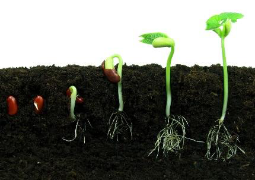
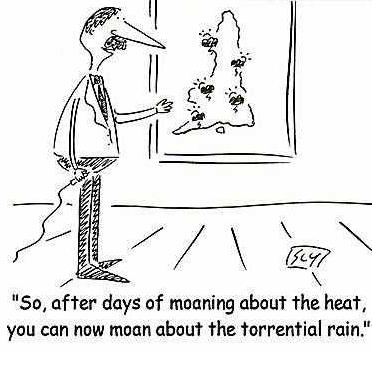
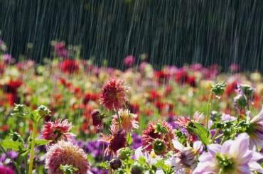
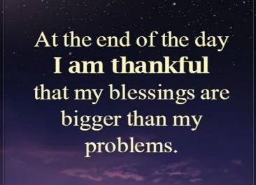

<!-- EXTRACTED IMAGES REFERENCE:
     Copy and paste these images into their correct template slots below!
# Extracted Asset reference: 
# Extracted Asset reference: 
# Extracted Asset reference: 
# Extracted Asset reference: 
# Extracted Asset reference: 
# Extracted Asset reference: 
# Extracted Asset reference: 
# Extracted Asset reference: 
# Extracted Asset reference: 
# Extracted Asset reference: 
# Extracted Asset reference: 
# Extracted Asset reference: 
# Extracted Asset reference: 
# Extracted Asset reference: 
# Extracted Asset reference: 
# Extracted Asset reference: 
-->

February brings a special gift,
To dark days of ice and snow;
Down in the bosom of the earth,
Dormant seed begins to grow.
Spring will come full of glory,
It’s all mapped out and planned;
It’s there for us and given free,
By our Heavenly Fathers’ hand.
As the seasons go on unchanging,
We never give it a thought you see;
We keep complaining about the weather,
More ungrateful than we ought to be.
We need a Higher Hand to guide us,
One that can benefit us all;
Warm summers and cold winters,
A fresh Spring and pleasant Fall.
We don’t need to lift a finger,
As dawn opens our sleepy eyes;
Every day in our life’s a bonus,
And could bring a nice surprise.
Accept your gift and be grateful,
It’s done for us all with Love;
Making our life on earth sweeter,
This Special Gift sent from Above.
February Thoughts
By Eila Webster

-- 1 of 1 --
