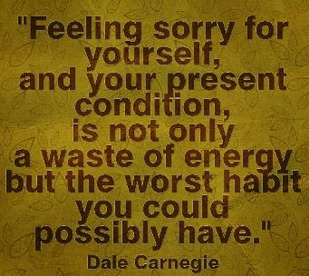
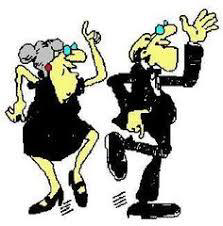
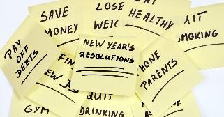

<!-- EXTRACTED IMAGES REFERENCE:
     Copy and paste these images into their correct template slots below!
# Extracted Asset reference: 
# Extracted Asset reference: 
# Extracted Asset reference: 
# Extracted Asset reference: 
# Extracted Asset reference: 
# Extracted Asset reference: 
# Extracted Asset reference: 
# Extracted Asset reference: 
# Extracted Asset reference: 
# Extracted Asset reference: 
# Extracted Asset reference: 
# Extracted Asset reference: 
# Extracted Asset reference: 
# Extracted Asset reference: 
# Extracted Asset reference: 
-->

As the old year fades away,
Another comes fresh and new;
We wonder what it will hold,
But it really is up to you.
Do you welcome it with open arms,
Full of exciting vim and vigour;
You’re the one at the helm,
Being ready to pull the trigger.
Or do you sit down and moan,
To shiver in the winter cold;
Stop feeling sorry for yourself,
Just get up and dance – be bold.
You can be active all your life,
Don’t let your body rot;
You’ll be surprised and happy,
If you use the strength you’ve got.
In later years use a cane,
To dance with it makes sense;
It is there to give you support,
And you’ll gain confidence.
Go and make your resolutions now,
This will make your moments sweet;
Making sure this will be the year,
That will keep you on your feet.
The New Year
By Eila Webster

-- 1 of 1 --
