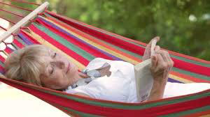
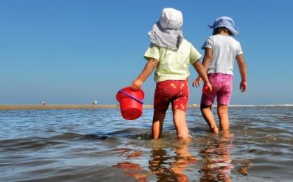
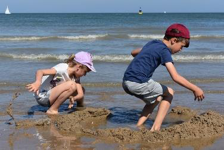
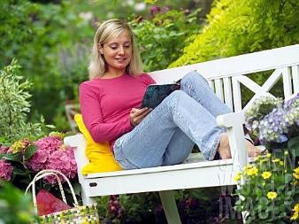
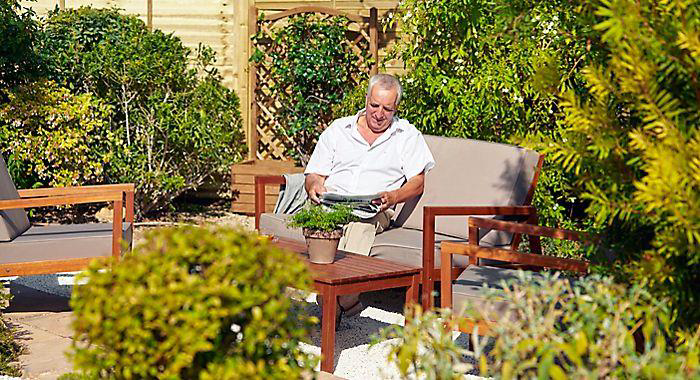
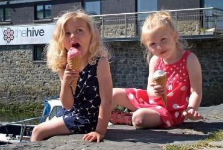
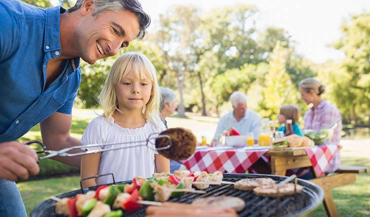
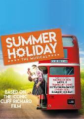

<!-- EXTRACTED IMAGES REFERENCE:
     Copy and paste these images into their correct template slots below!
# Extracted Asset reference: 
# Extracted Asset reference: 
# Extracted Asset reference: 
# Extracted Asset reference: 
# Extracted Asset reference: 
# Extracted Asset reference: 
# Extracted Asset reference: 
# Extracted Asset reference: 
# Extracted Asset reference: 
# Extracted Asset reference: 
# Extracted Asset reference: 
# Extracted Asset reference: 
# Extracted Asset reference: 
# Extracted Asset reference: 
-->

July brings holidays and fun,
A time for relaxing in the sun;
Leaving work and worries far behind,
Go paddle with the children to unwind.
There’s no need to be stripped of cash,
On expensive trips to make a splash;
You have it all outside your door,
Plenty places here you can explore.
Stop rushing around – just stand and stare,
Soak up the beauty that lies there;
This is the spot where you belong,
The place you chose to make home.
In your heart nothing can compare,
With all the happiness you have there;
Why go away to other lands,
You have it all here in your hands.
Just down tools and pack them all away,
Put on your glad rags and holiday;
With ice cream, meals out, a bus to town,
Your holiday at home won’t let you down.
By Eila Webster
Summer Relaxation & Fun

-- 1 of 1 --
