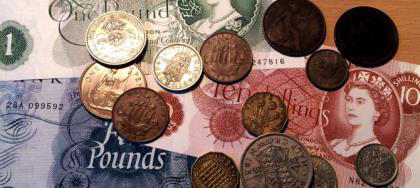
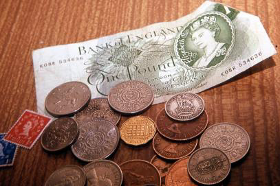
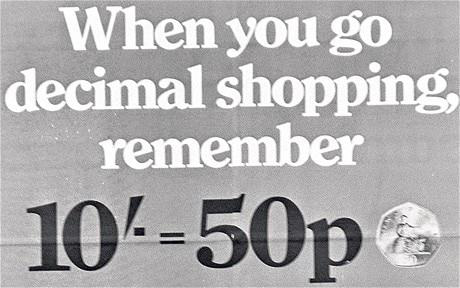
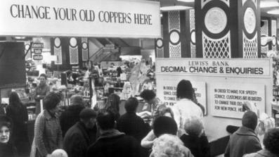
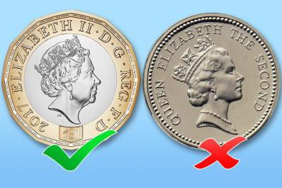
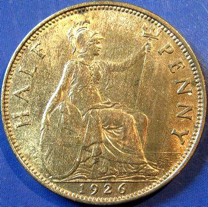

<!-- EXTRACTED IMAGES REFERENCE:
     Copy and paste these images into their correct template slots below!
# Extracted Asset reference: 
# Extracted Asset reference: 
# Extracted Asset reference: 
# Extracted Asset reference: 
# Extracted Asset reference: 
# Extracted Asset reference: 
# Extracted Asset reference: 
# Extracted Asset reference: 
# Extracted Asset reference: 
-->

Away back in my early days,
We still had Pounds, Shillings and Pence;
This served us well for countless years,
To change it didn’t make sense.
But the higher powers went ahead,
And changed to decimal currency;
Then all the money value changed,
When the familiar was taken away.
Young folk got on with it quite well,
But the older folk got confused;
The value and shape changed so much,
From the cash they had always used.
The look of money is changing again,
The £1 coin has flat bits on the rim;
Paper £5 notes have been replaced,
By beautiful strong ones, not so slim.
Other changes are likely to follow,
This is really quite good in a way;
They are so bright and cheerful now,
From the ones we had in Granny’s day.
Old now, I look back on sweet memories,
For nothing brought as much pleasure you see;
As running an errand for Granny back then,
And the thrill spending the treasured Bawbie.
All Change on the Money Front
By Eila Webster

-- 1 of 1 --
