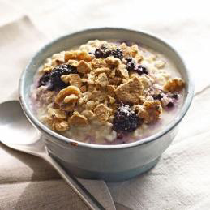
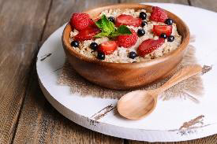
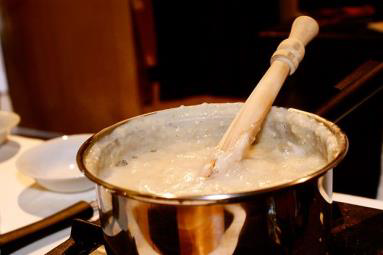
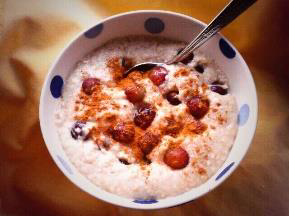
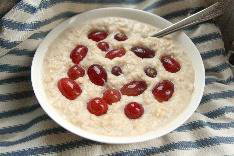
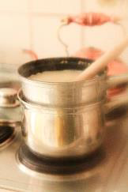

<!-- EXTRACTED IMAGES REFERENCE:
     Copy and paste these images into their correct template slots below!
# Extracted Asset reference: 
# Extracted Asset reference: 
# Extracted Asset reference: 
# Extracted Asset reference: 
# Extracted Asset reference: 
# Extracted Asset reference: 
# Extracted Asset reference: 
# Extracted Asset reference: 
# Extracted Asset reference: 
# Extracted Asset reference: 
# Extracted Asset reference: 
# Extracted Asset reference: 
# Extracted Asset reference: 
# Extracted Asset reference: 
# Extracted Asset reference: 
# Extracted Asset reference: 
# Extracted Asset reference: 
# Extracted Asset reference: 
-->

March month brings stormy weather,
That can have an icy blast;
So oatmeal is the perfect choice,
On which to break our fast.
Back in old time Bothy days,
Lads would start the day on brose;
Farm hands’ wives made porridge,
For their menfolk when they rose.
But in the modern way of life,
Oatmeal went out of favour;
Kids have so much to choose from,
With a sweet and chocolate flavour.
Yet porridge is the perfect dish,
You’ll find it so versatile;
It gives you lots of stamina,
To help go that extra mile.
Keep giving it a new flavour,
Add fruit and berries to the mix;
And breakfast will become a treat,
As you get perfect with the fix.
Be ready for what March may bring,
Just keep the porridge pot handy;
’Cause when you dine on Scotland’s fare,
You will stay warm and dandy.
March Winds
By Eila Webster

-- 1 of 1 --
