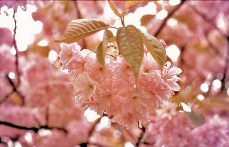
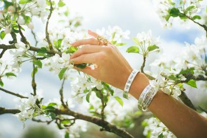
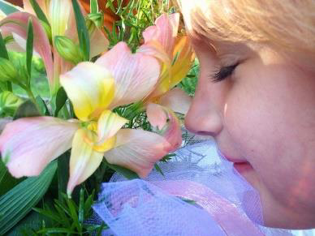
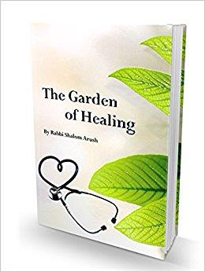
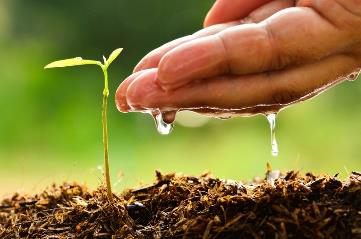
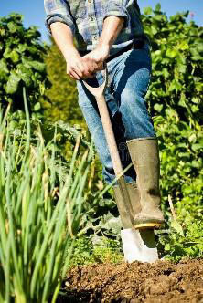
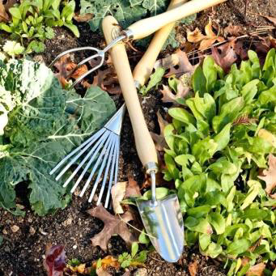
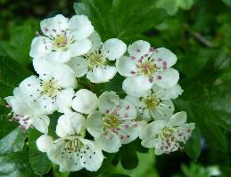
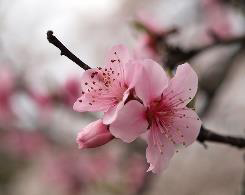
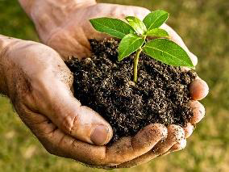

<!-- EXTRACTED IMAGES REFERENCE:
     Copy and paste these images into their correct template slots below!
# Extracted Asset reference: 
# Extracted Asset reference: 
# Extracted Asset reference: 
# Extracted Asset reference: 
# Extracted Asset reference: 
# Extracted Asset reference: 
# Extracted Asset reference: 
# Extracted Asset reference: 
# Extracted Asset reference: 
# Extracted Asset reference: 
# Extracted Asset reference: 
# Extracted Asset reference: 
# Extracted Asset reference: 
# Extracted Asset reference: 
# Extracted Asset reference: 
# Extracted Asset reference: 
# Extracted Asset reference: 
# Extracted Asset reference: 
# Extracted Asset reference: 
-->

May is the month of blossom,
Flowers are blooming everywhere;
Urging us to get outdoors,
As their perfume fills the air.
To tidy the winter garden,
You get out spade, graip and hoe;
And find a surge of energy,
With new strength to have a go.
There is healing in a garden,
For as you till the soil;
You feel the pull of nature,
And touch the hand of God.
As you sow weed reap and hoe,
Your pain and troubles cease;
You blend in with the Universe,
And find an inner peace.
Like an ever-beating heart,
That surges through your veins;
Taking away impurities,
‘til only the good remains.
The here and now just fade away,
Forgotten as you toil;
Caught up in an ageless time,
To find healing in the soil.
May Blossom
By Eila Webster

-- 1 of 1 --
