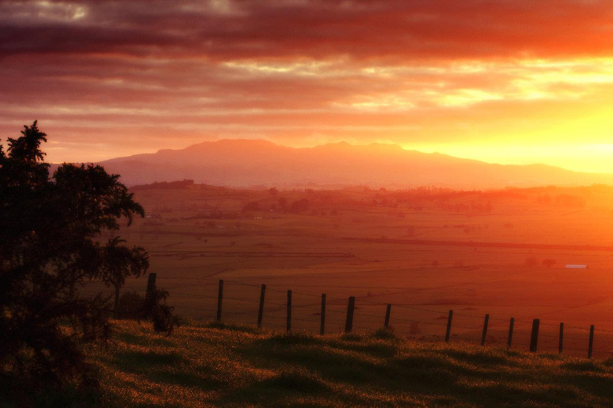

<!-- EXTRACTED IMAGES REFERENCE:
     Copy and paste these images into their correct template slots below!
# Extracted Asset reference: 
# Extracted Asset reference: 
-->

I Greet the Dawn
I greet the dawn – a streak of light,
Waking from slumbers of the night;
To see unfold a new born day,
That is mine to use now as I may;
Will my chosen path be right,
For it is still veiled from sight;
Even if some unknown plight,
Put plans in disarray,
I greet the Dawn.
Gallantly life’s trials I’ll fight,
And do my best to get it right;
For tomorrow is another day,
When everything may go my way;
Rising refreshed and with Delight,
I greet the Dawn.
By Eila Webster

-- 1 of 1 --
