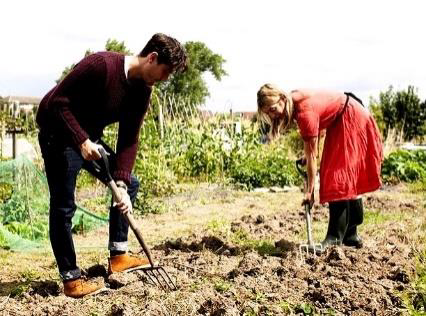
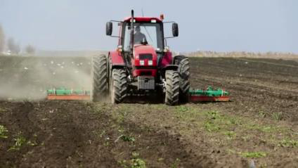
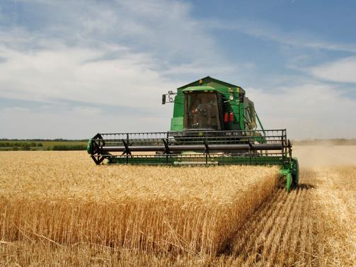
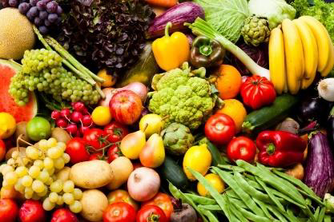
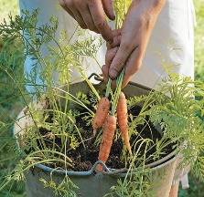
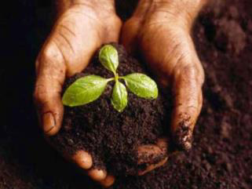
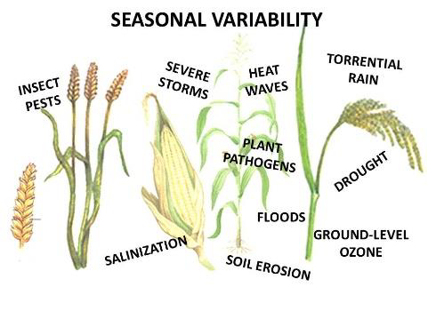
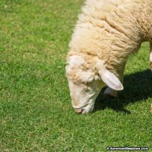
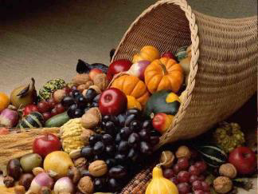

<!-- EXTRACTED IMAGES REFERENCE:
     Copy and paste these images into their correct template slots below!
# Extracted Asset reference: 
# Extracted Asset reference: 
# Extracted Asset reference: 
# Extracted Asset reference: 
# Extracted Asset reference: 
# Extracted Asset reference: 
# Extracted Asset reference: 
# Extracted Asset reference: 
# Extracted Asset reference: 
# Extracted Asset reference: 
# Extracted Asset reference: 
# Extracted Asset reference: 
# Extracted Asset reference: 
# Extracted Asset reference: 
# Extracted Asset reference: 
# Extracted Asset reference: 
# Extracted Asset reference: 
# Extracted Asset reference: 
-->

Farming is so healthy and rewarding,
For as the soil you till;
You are living close to nature,
As you perform our Saviour’s will.
We’ve been put upon this planet,
To cultivate the land;
Sowing, tending, harvesting,
Guided by our Maker’s hand.
He who guides the growing force,
The sunshine and the rain;
Filling streams with water,
And swelling ears of grain.
Ripening fruit and vegetables,
Grown for us all to eat;
The grass for sheep and cattle,
A source of milk and meat.
Wool for coats and blankets,
To keep out the winter chill;
If we work with our Provider,
He will all our needs fulfil.
Yes! Farming families down the years,
Have been our Earth’s mainstay;
So we thank our Lord for the Harvest,
In our heartfelt prayers today.
Farming Matters
By Eila Webster
The hot summer and
lack of rain has
made farming
difficult this year!
Climate changes in
the last ten years
have made farming
more difficult!

-- 1 of 1 --
