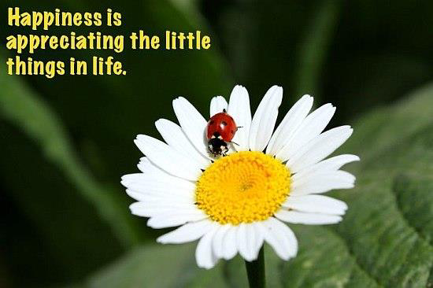
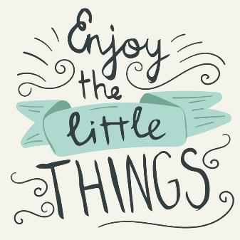
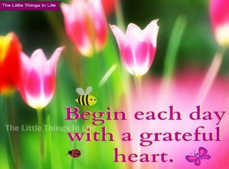
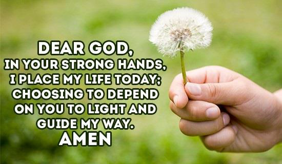
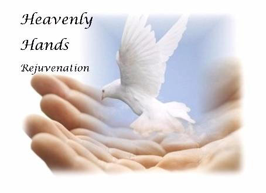

<!-- EXTRACTED IMAGES REFERENCE:
     Copy and paste these images into their correct template slots below!
# Extracted Asset reference: 
# Extracted Asset reference: 
# Extracted Asset reference: 
# Extracted Asset reference: 
# Extracted Asset reference: 
# Extracted Asset reference: 
# Extracted Asset reference: 
# Extracted Asset reference: 
# Extracted Asset reference: 
# Extracted Asset reference: 
# Extracted Asset reference: 
# Extracted Asset reference: 
# Extracted Asset reference: 
# Extracted Asset reference: 
# Extracted Asset reference: 
-->

It’s the little things that bring joy,
As we journey on through life;
Which are often over shadowed by,
Years of discontent and strife.
We struggle on wanting more and more,
Hate and envy rear their head;
What could have been a cheerful World,
Is full of wars and crime instead.
Now! Where do we go from here?
We must all stop and think;
How can we salvage our lovely home,
And pull it from the brink.
Start by being contented,
And happy with your lot;
A Heavenly hand will guide you,
To improve on what you’ve got.
Many hands make light work,
If we all do the best we can;
We will have a home again,
That’s fit for our fellow man.
Appreciation & Contentment
By Eila Webster

-- 1 of 1 --
