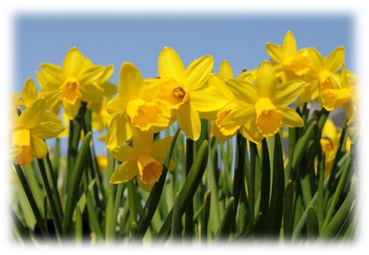
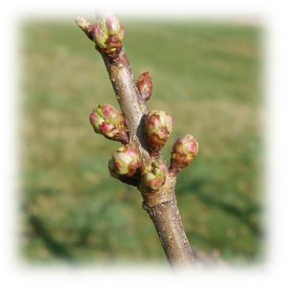
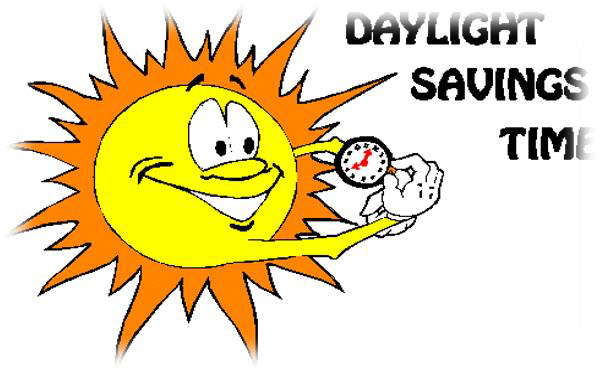
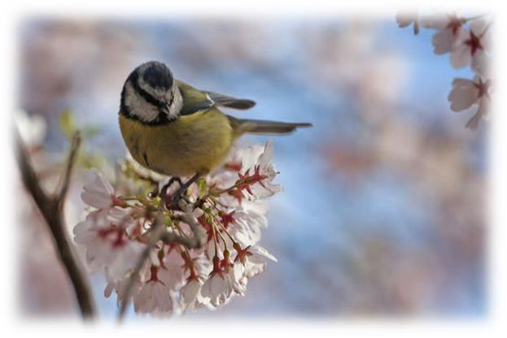
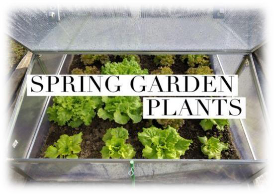
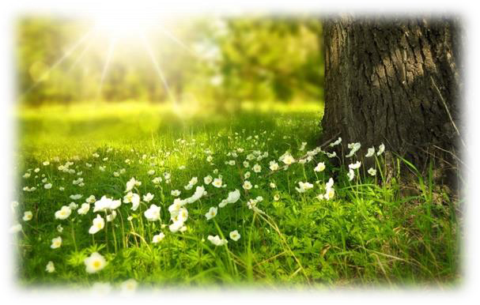

<!-- EXTRACTED IMAGES REFERENCE:
     Copy and paste these images into their correct template slots below!
# Extracted Asset reference: 
# Extracted Asset reference: 
# Extracted Asset reference: 
# Extracted Asset reference: 
# Extracted Asset reference: 
# Extracted Asset reference: 
# Extracted Asset reference: 
# Extracted Asset reference: 
# Extracted Asset reference: 
-->

The daffodils are blooming freely,
You’ll find them everywhere;
And other buds are opening up’
As perfume fills the air.
The daylight hours are longer,
And as you find the temperature rise;
The speed the grass is growing,
Could take you by surprise.
Yet April is a happy month,
Birds fill the air with song;
Courting freely with their mates,
They sing the whole day long.
Yes! April is truly magical,
A special gift that’s given free;
With love from our maker,
Every spring for you and me.
April’s Charm
By Eila Webster

-- 1 of 1 --
