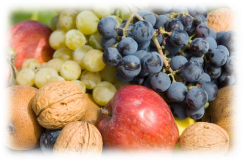
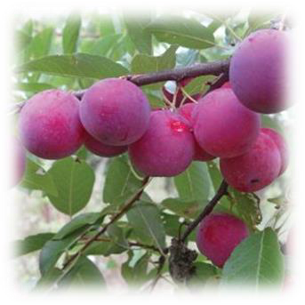
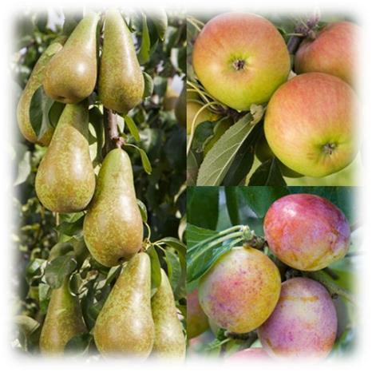
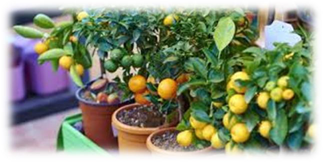
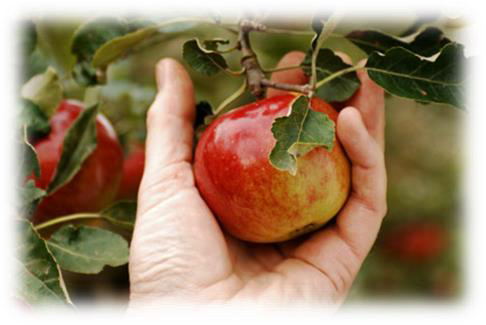
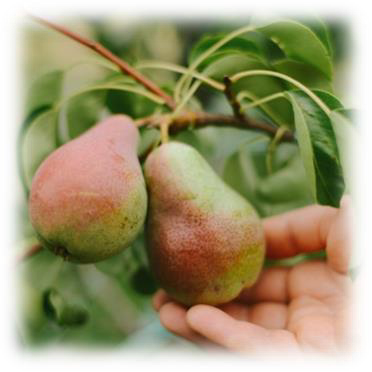
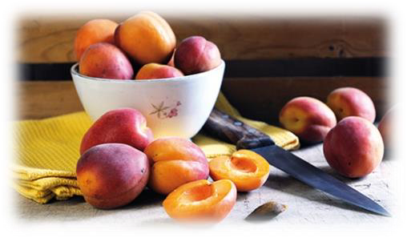
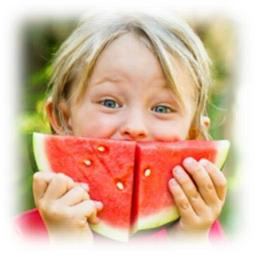

<!-- EXTRACTED IMAGES REFERENCE:
     Copy and paste these images into their correct template slots below!
# Extracted Asset reference: 
# Extracted Asset reference: 
# Extracted Asset reference: 
# Extracted Asset reference: 
# Extracted Asset reference: 
# Extracted Asset reference: 
# Extracted Asset reference: 
# Extracted Asset reference: 
# Extracted Asset reference: 
-->

August is the month for fruit,
Apples, Damson, Pears and Plums;
Late berries are ripe and some grow wild,
So out you go and fill your tums.
Make the most of nature’s bounty,
Like folk did in days gone by;
To store up for the winter months,
On what they could rely.
This went on for countless years,
This served us well you will agree;
From generation to generation,
As far back as I can see.
So different to the modern trend,
That we all use today;
We pop into the local shop,
For what we need day by day.
Loss of flavour is accepted,
It’s only known now by a few;
From the older generations,
When food was rich and true.
You have the best of both times now,
With easy shopping and lots of fun;
And healthy berries ripe for you to eat,
When all your chores are done .
August is the Month for Fruit
By Eila Webster

-- 1 of 1 --
