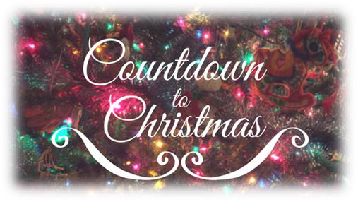
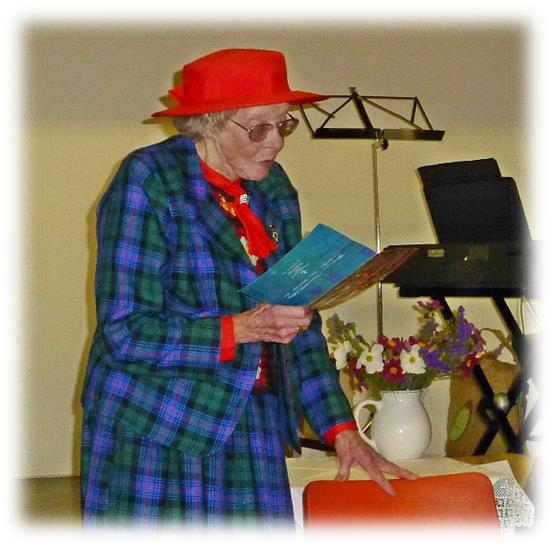

<!-- EXTRACTED IMAGES REFERENCE:
     Copy and paste these images into their correct template slots below!
# Extracted Asset reference: 
# Extracted Asset reference: 
# Extracted Asset reference: 
# Extracted Asset reference: 
# Extracted Asset reference: 
# Extracted Asset reference: 
# Extracted Asset reference: 
# Extracted Asset reference: 
# Extracted Asset reference: 
# Extracted Asset reference: 
# Extracted Asset reference: 
# Extracted Asset reference: 
# Extracted Asset reference: 
# Extracted Asset reference: 
-->

Where have all the days gone,
The year is just slipping away;
And December is fast approaching,
Towards the thrills of Christmas Day.
Looking back do you sometimes wonder,
On how you used your time;
Did you always do your very best?
I just wrote mine in a rhyme.
Now the years are catching up on me,
It’s difficult to keep up the pace;
But I am doing a web verse,
For Decembers’ Westmuir space.
This keeps the old brain active,
I still hope to carry on;
It gives me lots of pleasure,
Writing verses – when alone.
May you have a jolly Christmas,
And Good Wishes for the New Year;
And if I’m spared to carry on,
I’ll write verses for you next year.
It’s the Christmas Season
Again!
By Eila Webster

-- 1 of 1 --
