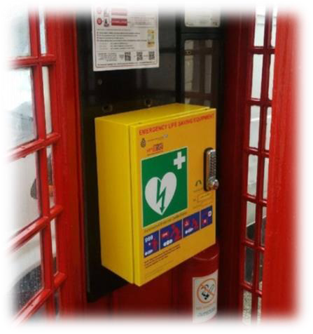
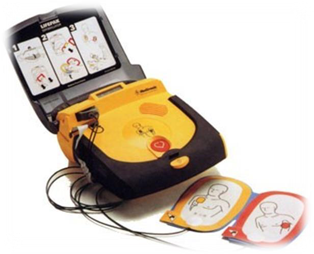
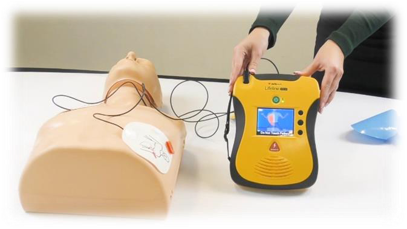
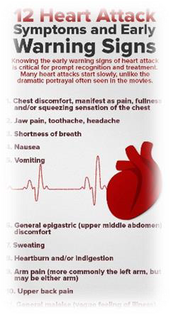

<!-- EXTRACTED IMAGES REFERENCE:
     Copy and paste these images into their correct template slots below!
# Extracted Asset reference: 
# Extracted Asset reference: 
# Extracted Asset reference: 
# Extracted Asset reference: 
# Extracted Asset reference: 
# Extracted Asset reference: 
# Extracted Asset reference: 
# Extracted Asset reference: 
# Extracted Asset reference: 
# Extracted Asset reference: 
-->

When Westmuir Defibrillator Group joined up,
With the Community Heartbeat Trust ;
In the old phone box at the Shoppie,
To give your support now is a MUST.
Getting it up and running,
Would be a great day for us all;
If everyone gave their very best,
Whether it be large or small.
Financial help is still needed,
And gifts of kind are welcome too;
Ideas to brighten up the site,
To make it fresh and new.
No longer a sleepy village,
We could save a life you see;
Having the equipment here,
A great achievement you’ll agree.
So throw your whole self in it,
Work on it with a smile;
I know you won’t regret it,
When you go that extra mile.
Westmuir’s Defibrillator
By Eila Webster

-- 1 of 1 --
