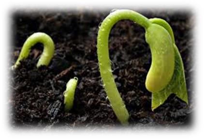

<!-- EXTRACTED IMAGES REFERENCE:
     Copy and paste these images into their correct template slots below!
# Extracted Asset reference: 
# Extracted Asset reference: 
# Extracted Asset reference: 
# Extracted Asset reference: 
# Extracted Asset reference: 
# Extracted Asset reference: 
# Extracted Asset reference: 
# Extracted Asset reference: 
# Extracted Asset reference: 
# Extracted Asset reference: 
-->

February brings a subtle change,
From January’s dark, wet, windy days;
Bringing a strong surge of growth,
In a lot of different ways.
Seeds are now sprouting strongly,
Tiny flowers are in bloom;
Winter sun is stronger now,
And can chase away the gloom.
But winter isn’t over yet,
We could still get ice and snow;
Just dress warm on sunny days,
Go out – let the cobwebs blow.
Spring is just around the corner,
There’s no need to hibernate;
A brisk walk on a bright day,
Will leave you feeling great.
February is the shortest month,
Make the most of every minute;
It will be so worthwhile,
If you put your whole heart in it.
Don’t strive for fame and fortune though,
Happiness is the key;
It is God’s choice from Heaven,
Sent down for you and me.
The Month of Subtle Change
By Eila Webster

-- 1 of 1 --
