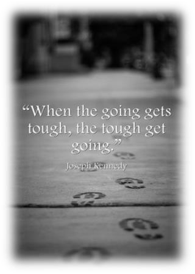
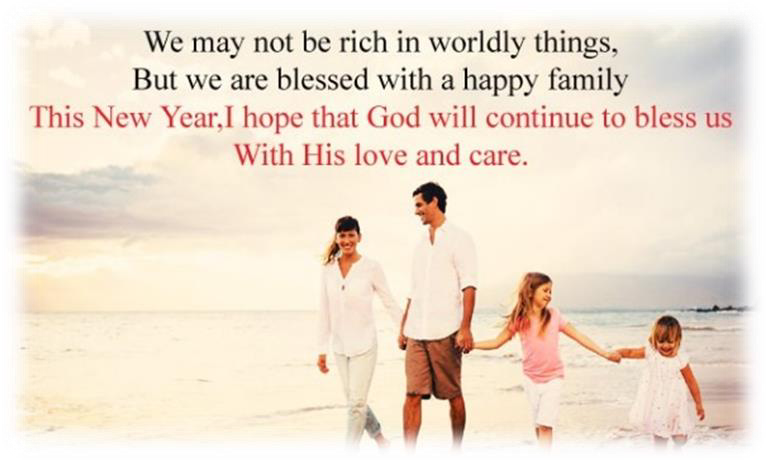
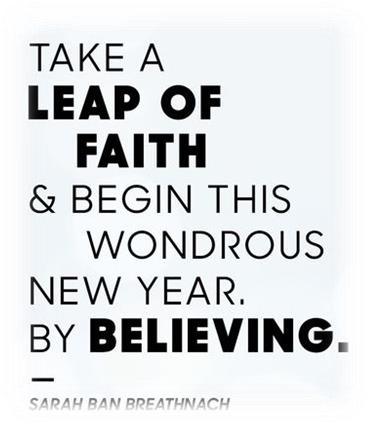
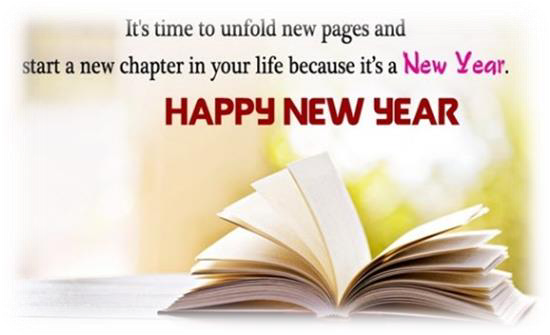
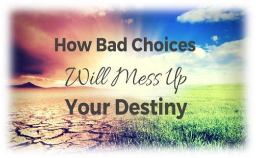
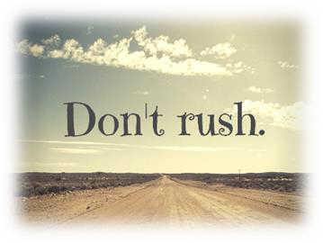
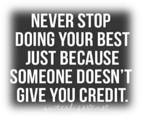

<!-- EXTRACTED IMAGES REFERENCE:
     Copy and paste these images into their correct template slots below!
# Extracted Asset reference: 
# Extracted Asset reference: 
# Extracted Asset reference: 
# Extracted Asset reference: 
# Extracted Asset reference: 
# Extracted Asset reference: 
# Extracted Asset reference: 
# Extracted Asset reference: 
# Extracted Asset reference: 
-->

As 2018 fades away,
And we step into the new;
We wonder what it will hold,
But this all depends on you.
The years go on unchanging,
Still we go our chosen way;
And just because we are human,
There’s a big chance to go astray.
Consider your options carefully,
There’s no hurry - take your time;
Twelve months lie before you,
And to hesitate is no crime.
Success is still worth waiting for,
And this could be the year;
Keep on giving your very best,
And you have nought to fear.
Even when the going’s hard,
If you can raise a smile;
You will find the strength you need,
To go that extra mile.
Another Year Begins
By Eila Webster

-- 1 of 1 --
