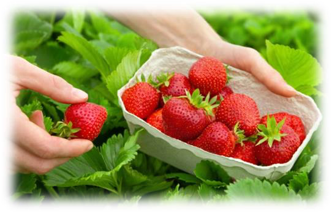
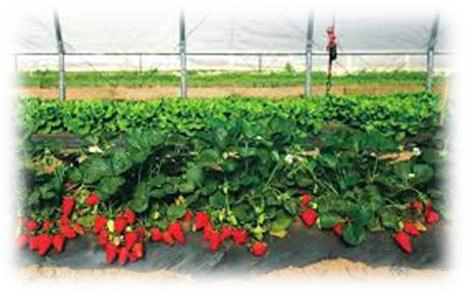
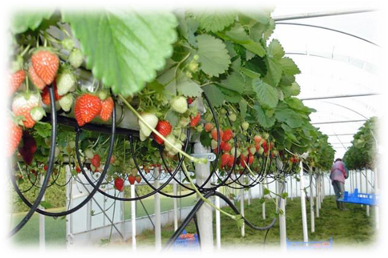
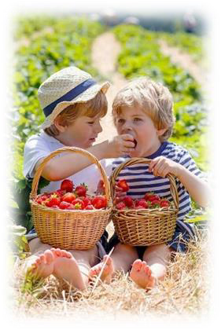

<!-- EXTRACTED IMAGES REFERENCE:
     Copy and paste these images into their correct template slots below!
# Extracted Asset reference: 
# Extracted Asset reference: 
# Extracted Asset reference: 
# Extracted Asset reference: 
# Extracted Asset reference: 
# Extracted Asset reference: 
# Extracted Asset reference: 
# Extracted Asset reference: 
# Extracted Asset reference: 
-->

July brings the Summer,
Time for holidays and fun;
Strawberries are in season,
A real treat for everyone.
Growing in the garden,
And eaten on the spot;
Have a delicious flavour,
That bought ones haven’t got.
But in this modern way of life,
Things all depend on speed;
Grown in fancy containers,
Where you never see a weed.
But what we lose in flavour,
We gain with more leisure time;
And things are a lot better,
Than in those days lang syne.
So put on your glad rags,
And live life to the full;
It’s time to renew your youth,
When the kids are out from school.
July’s Long Summer Days
By Eila Webster

-- 1 of 1 --
