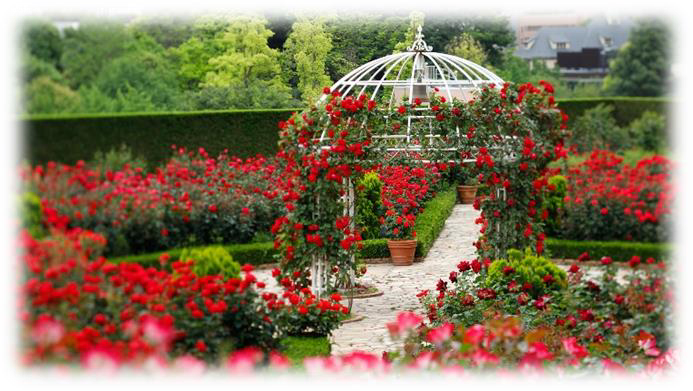
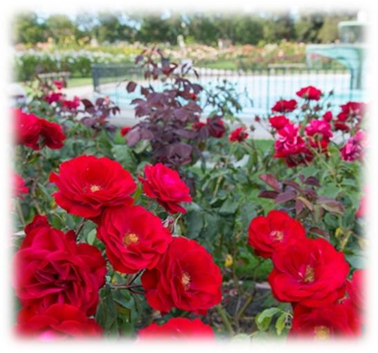
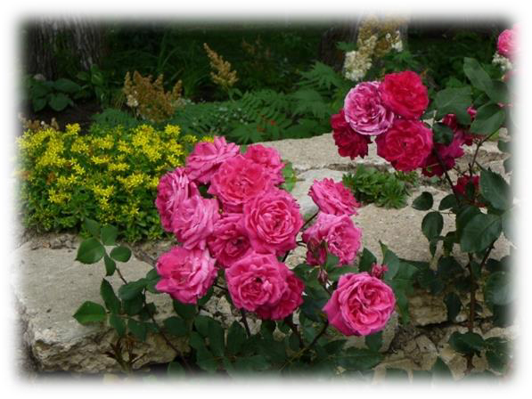
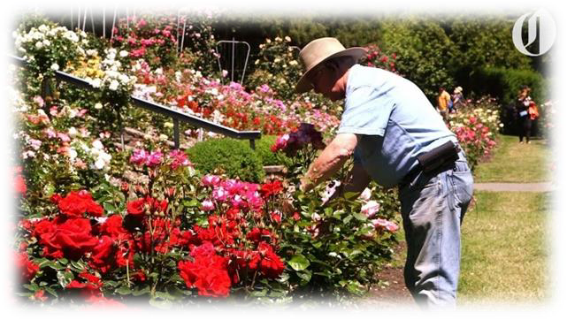
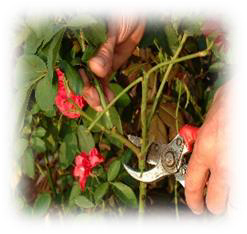

<!-- EXTRACTED IMAGES REFERENCE:
     Copy and paste these images into their correct template slots below!
# Extracted Asset reference: 
# Extracted Asset reference: 
# Extracted Asset reference: 
# Extracted Asset reference: 
# Extracted Asset reference: 
# Extracted Asset reference: 
# Extracted Asset reference: 
# Extracted Asset reference: 
# Extracted Asset reference: 
-->

June is the month of Roses,
Blooming freely everywhere;
Filling hearts this joyful season,
When love is in the air.
As we leave the winter behind,
For warm and dry days in the sun;
You find the benefit is remarkable,
It is pure joy for everyone.
Suddenly your energy is restored,
And ready to tackle anything;
Eager now to do your best,
Whatever the day may bring.
You are sure to find a niche in life,
In which you can excel;
Keep on trying different things,
Till you find what you do well.
Maybe you’ll never become a star,
With letters attached to your name;
But in real life you are a Doer,
And so worthy of a claim.
You carry on year after year,
Working happily with your lot;
You are loved and respected,
So you will never be forgot.
Much better than letters top of a page,
That can forgotten lie;
You’ll keep on blooming like the Rose,
For your roots will never die.
June is the month of Roses
By Eila Webster

-- 1 of 1 --
