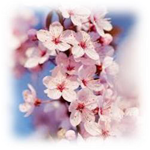
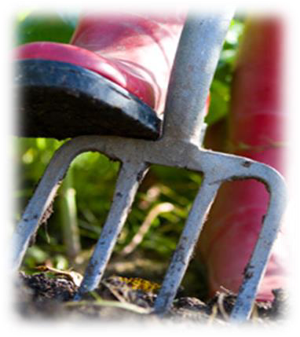
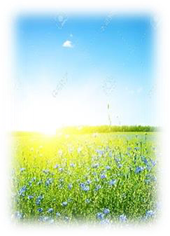
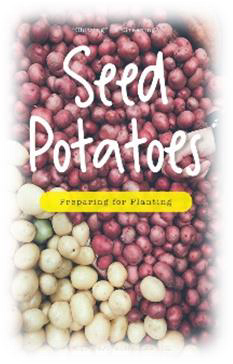
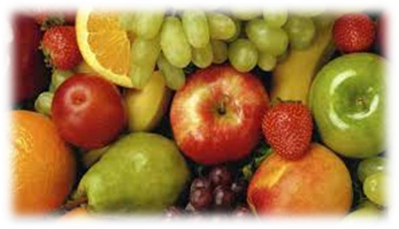
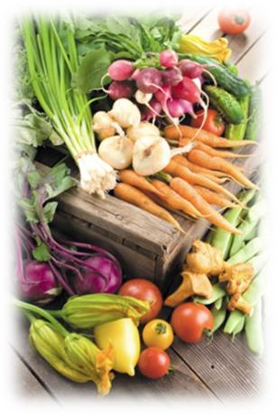
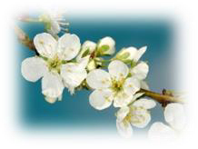
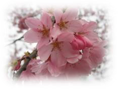
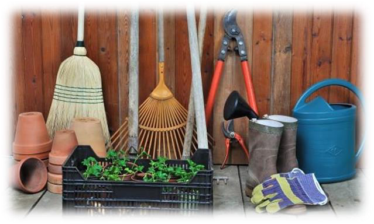
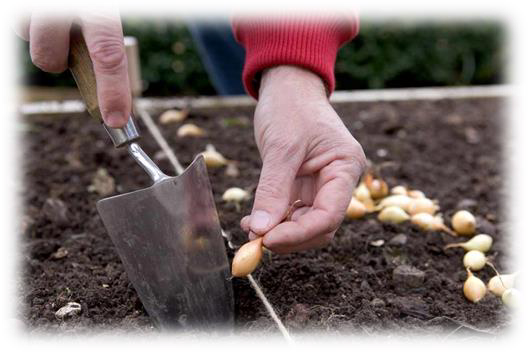

<!-- EXTRACTED IMAGES REFERENCE:
     Copy and paste these images into their correct template slots below!
# Extracted Asset reference: 
# Extracted Asset reference: 
# Extracted Asset reference: 
# Extracted Asset reference: 
# Extracted Asset reference: 
# Extracted Asset reference: 
# Extracted Asset reference: 
# Extracted Asset reference: 
# Extracted Asset reference: 
# Extracted Asset reference: 
# Extracted Asset reference: 
-->

May is the month of blossom,
You find it everywhere;
On shrubs on trees and gardens,
Proclaiming spring is in the air.
Daylight hours are warmer,
With sunlight shining bright;
Early in the morning now,
To fill hearts with delight.
Roll up your sleeves – get busy,
Now there is lots to do;
Growing fruit and vegetables,
To last the whole year through.
The lawn just keeps on growing,
And weeds – they never fade ;
It’s time for the garden tools,
So out comes the hoe and spade .
Preparing the ground for planting ,
Potatoes, beans and peas;
There’s no time here this month,
To take things at your ease.
But hard work now is worth it,
When you have your winter store;
All fresh and home grown,
Now who could wish for more.
So do your very best this month,
And carry on with a smile;
Enjoying your home-grown harvest,
Makes everything worthwhile.
Colourful May
By Eila Webster

-- 1 of 1 --
