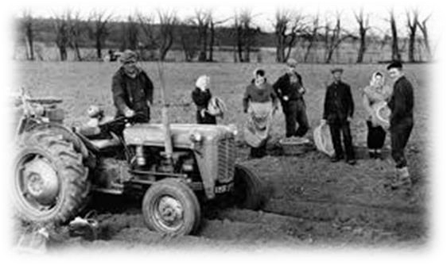
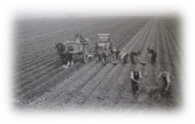
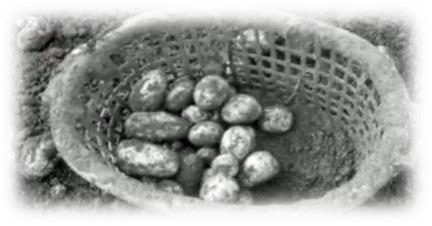
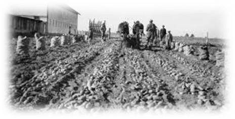
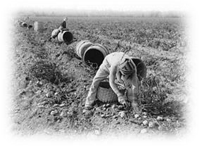
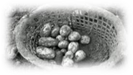
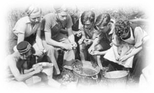

<!-- EXTRACTED IMAGES REFERENCE:
     Copy and paste these images into their correct template slots below!
# Extracted Asset reference: 
# Extracted Asset reference: 
# Extracted Asset reference: 
# Extracted Asset reference: 
# Extracted Asset reference: 
# Extracted Asset reference: 
# Extracted Asset reference: 
-->

Tattie time is roon again , auld claes get lookit oot,
So aince again it gets the air – my yellow trouser suit.
The sun for us it fairly shone, I got my pinny aff;
But my jacket it flew ower my heid , and Ena had tae laugh.
My yellow bum stuck in the air, I very nearly drappit,
Being ane o’ the modest kind, I like my backend happit.
Yet the lads micht fancy me , the thought warmed my heart;
But ae look gave them the jaundice, a’ the lads upon the cart.
I dinna really ken the lads, that’s throwin creels this year;
They are a lot o’ swinginn guys wi’ a’ their grand mod gear.
In pink cords and fancy shirts, hair curly, straight and lang;
Reedie fair turns the lassies on, we sic a glamourous gang.
But there’s a lad that I ken fine, my heart throb Willie Hume;
And every time he smiles to me, my heart sings a love tune.
Noo Harry ... he likes to grab a leg, ... it is a great temptation;
A lassie in a mini skirt could be his ruination.
Then there’s Bob ... a cheery chap, though you wouldna’ ca’ him
bonny;
He wears his bonnet tae the side, just like an ‘onion Johnie.’
In a’ the years I hae come here, I’ve never seen the like;
For maist days its been warm, and the sun for us would shine,
Makin it a pleasure to work here this tattie time.
So here’s ‘Guid Health’ to Fermer Bill, and ‘Guid Luck’ to the
Bairn;
Hoo I will miss your jolly crew and wonder hoo you’re farin.
But though this season’s near an end if I am spared and weel,
Next year will see me back again pickin tatties on my creel.
Reedie’s Tatties 1971
By Eila Webster

-- 1 of 1 --
