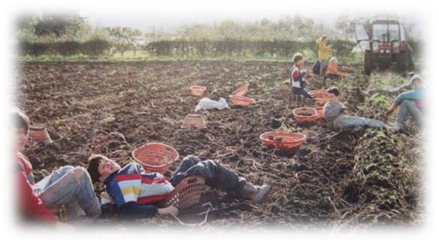
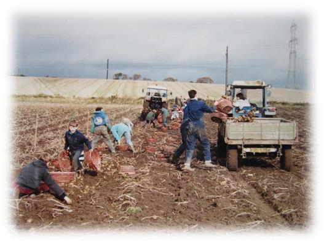
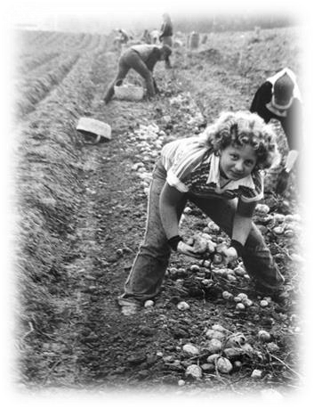
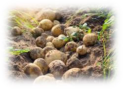
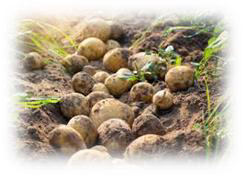
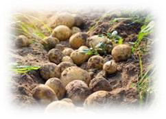
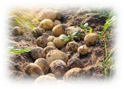
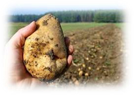
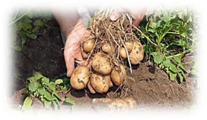

<!-- EXTRACTED IMAGES REFERENCE:
     Copy and paste these images into their correct template slots below!
# Extracted Asset reference: 
# Extracted Asset reference: 
# Extracted Asset reference: 
# Extracted Asset reference: 
# Extracted Asset reference: 
# Extracted Asset reference: 
# Extracted Asset reference: 
# Extracted Asset reference: 
# Extracted Asset reference: 
-->

Well Bill this is to say goodbye,
For tattie time is o’er;
You won’t be going to Kirrie,
With the ‘bogey’ any more.
Now that the season’s at an end,
I’m sure you will be glad;
But you have done real well this year,
As Gaffer of the squad.
Although we’ve had our ups and downs,
This tattie time’s been fun;
You really are a jolly sport,
To be the farmer’s son.
You show no airs and graces,
You never make a fuss;
It’s fine to feel at tattie time,
That you are one of us.
Now that your tatties are all in,
Have some pity for poor me;
For I am just beginning,
The tattie time you see.
Before we plough our tatties out,
WE have to pull each shaw;
So spare a thought for me my friend,
And bring along some straw.
Well it’s with a struggle, Bill,
We end this tattie time;
Its also been a struggle,
For me to end this rhyme.
But we have had a happy time,
A’working here for you;
So this comes with best wishes from,
Your faithful bogey crew.
Tattie Picking .... October 1967
By Eila Webster

-- 1 of 1 --
