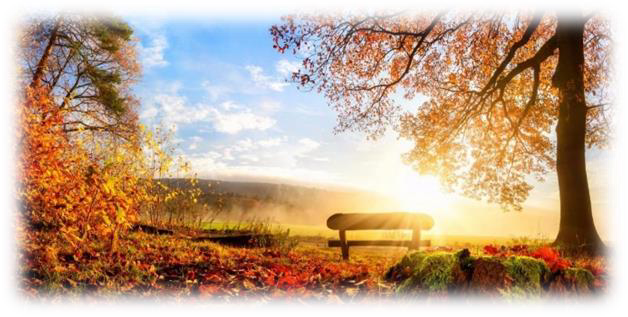
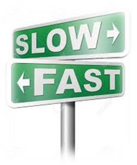
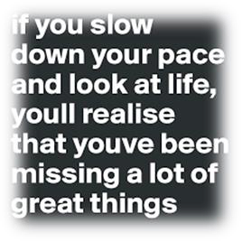
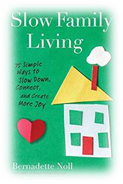

<!-- EXTRACTED IMAGES REFERENCE:
     Copy and paste these images into their correct template slots below!
# Extracted Asset reference: 
# Extracted Asset reference: 
# Extracted Asset reference: 
# Extracted Asset reference: 
# Extracted Asset reference: 
# Extracted Asset reference: 
# Extracted Asset reference: 
# Extracted Asset reference: 
# Extracted Asset reference: 
# Extracted Asset reference: 
-->

September to me is special,
With its soft warm sunny days;
The searing heat of summer‘s gone,
This is worthy of our praise.
Just slow your pace a little,
Take time to enjoy the view;
We weren’t meant to rush through life,
So make time just for you.
Go do what makes you happy,
It doesn’t need to cost a bean;
For simple pleasures are the best,
And they stay evergreen.
There’s no rush and no packing,
Or struggling with your gear;
Meals are easy, within reach,
And all you need is here.
So this month take a holiday,
Just go outside your door;
And let September cast her spell,
You have no need for more.
September … A Special
Month
By Eila Webster

-- 1 of 1 --
