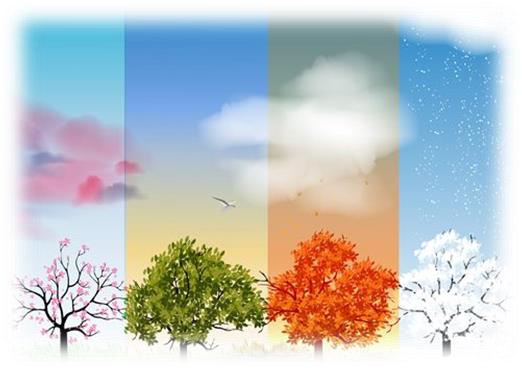
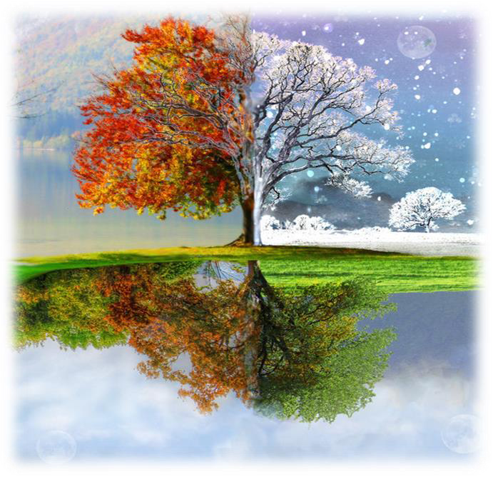
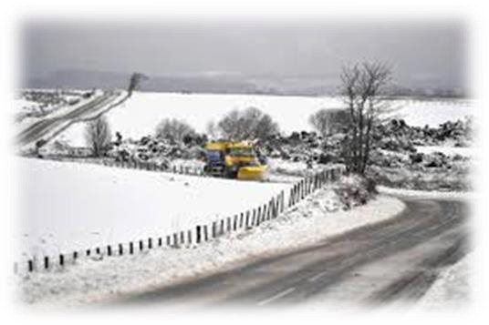
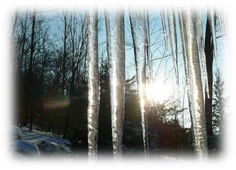
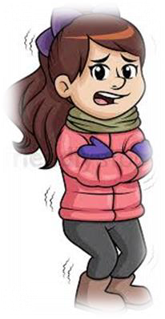
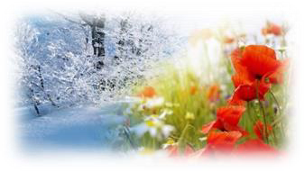
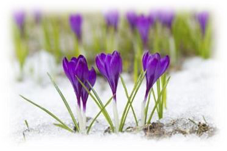
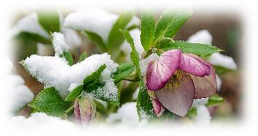
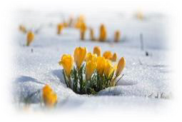
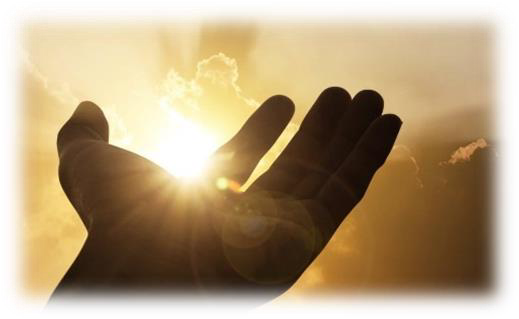

<!-- EXTRACTED IMAGES REFERENCE:
     Copy and paste these images into their correct template slots below!
# Extracted Asset reference: 
# Extracted Asset reference: 
# Extracted Asset reference: 
# Extracted Asset reference: 
# Extracted Asset reference: 
# Extracted Asset reference: 
# Extracted Asset reference: 
# Extracted Asset reference: 
# Extracted Asset reference: 
# Extracted Asset reference: 
-->

Our seasons now are changing,
It seems like that to me,
January already half-way in,
And still no snow you see.
Oh! I am not complaining,
But I still think it is queer;
To not see any white stuff,
Lying on the ground this year.
There’ll be time for ice and shivers,
E’er February gets a hold;
Filling Lakes and Rivers,
As it has done in days of ‘Olde’.
Yes! The years go on unending,
They are all mapped out and planned;
Given to the human race,
From our Heavenly Father’s hand.
But care doesn’t stop there,
It carries on all year;
Bringing lighter moments too,
To fill our hearts with cheer.
Growth is now in evidence,
As plants begin to grow;
Spring is round the corner,
So let’s – Get Up and Go !
Our Changing Seasons
By Eila Webster

-- 1 of 1 --
