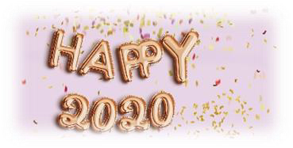
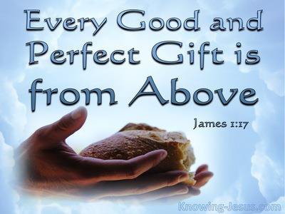
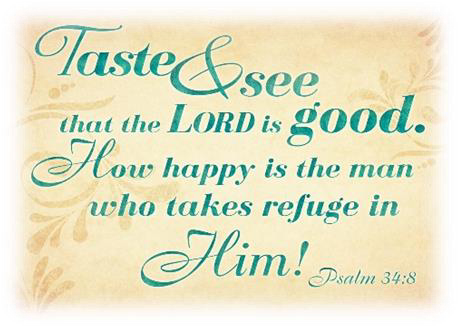
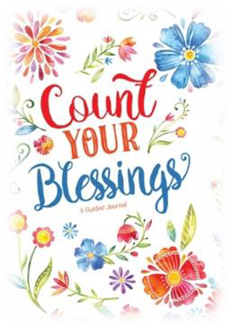
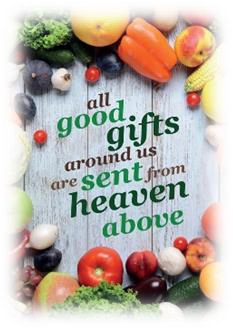
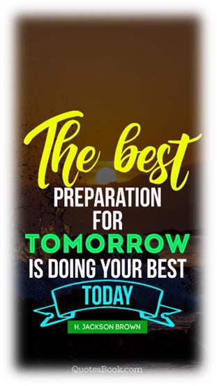
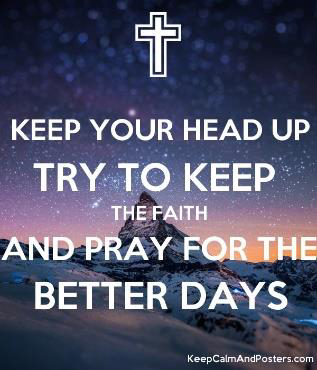
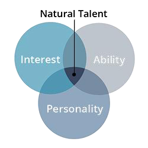

<!-- EXTRACTED IMAGES REFERENCE:
     Copy and paste these images into their correct template slots below!
# Extracted Asset reference: 
# Extracted Asset reference: 
# Extracted Asset reference: 
# Extracted Asset reference: 
# Extracted Asset reference: 
# Extracted Asset reference: 
# Extracted Asset reference: 
# Extracted Asset reference: 
# Extracted Asset reference: 
# Extracted Asset reference: 
# Extracted Asset reference: 
# Extracted Asset reference: 
# Extracted Asset reference: 
-->

As the old year slips away,
A new day takes its place;
A yearly gift from the Lord,
Given to the Human Race.
We take it all for granted,
We don’t give it a thought;
Yet we should be so grateful,
And give thanks as we ought.
Without Divine help we are powerless,
So take the time to pray;
And give a humble Thank you,
That’s all you need to say.
You’ll enjoy the year ahead,
And all the blessings we are given;
Make the most of natural gifts,
Sent down with love from Heaven.
Why keep crying out for more’
A simple life is best;
Just have faith in your Maker,
And you will be truly blessed.
May the days that lie ahead,
Give wings to your feet;
Making this a special year,
That is wonderfully sweet.
Thoughts for the New Year
By Eila Webster

-- 1 of 1 --
